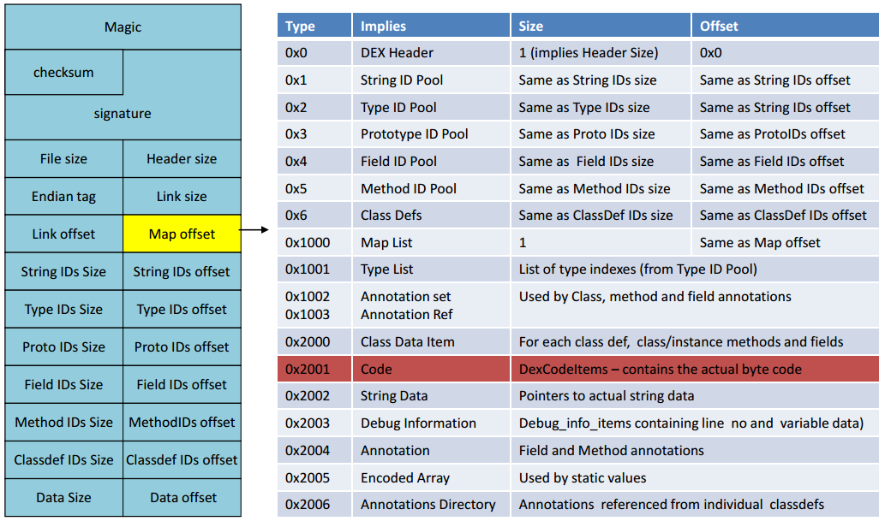

# Android 8.0 VDEX机制简介


### 背景

Android 8.0在odex的基础上又引入了vdex机制，目的是为了降低dex2oat时间。
因为当系统ota后，用户自己安装的应用是不会发生任何变化的，但framework代码已经发生了变化，
所以就需要重新对这些应用也做dex2oat，所以如果有vdex的话，就可以省去重新校验apk里dex文件合法性的过程，节省一部分时间，所以本文分析下vdex的实现机制。

| 文件格式   | 用途                                           |
| ---------- | ---------------------------------------------- |
| .dex       | 存储java字节码                                 |
| .odex/.oat | optimized dex，ELF格式                         |
| .vdex      | verified dex，包含 raw dex +（quicken info)    |
| .art       | image文件，存储热点方法string, method, types等 |

<!-- more -->

### 首个VDEX实现相关commit：

```
commit 7b49e6cade09bc65b3b5f22d45fc9d0a7184e4f2
Author: David Brazdil <dbrazdil@google.com>
Date:   Thu Sep 1 11:06:18 2016 +0100
```

主要目的：降低dex2oat执行耗时
1、当系统OTA后，对于安装在data分区下的app，因为它们的apk都没有任何变化，那么在首次开机时，对于这部分app如果有vdex文件存在的话，执行dexopt时就可以直接跳过verify流程，进入compile dex的流程，从而加速首次开机速度；
2、当app的jit profile信息变化时，background dexopt会在后台重新做dex2oat，因为有了vdex，这个时候也可以直接跳过

### 原理

应用首次安装时，抽取出其中的dex文件，校验成功后，存储到一个独立的文件中，后面由于jit profile改变，或OTA等原因，而重新进行dexopt时，可以跳过dex文件校验流程

### 具体实现：

dex2oat关键路径： main() → setup() → compileApp()

```c++
// art/dex2oat/dexoat.cc
int main(int argc, char** argv) {
  return static_cast<int>(art::Dex2oat(argc, argv));
}
 
static dex2oat::ReturnCode Dex2oat(int argc, char** argv) {
  dex2oat->ParseArgs(argc, argv);
  dex2oat::ReturnCode setup_code = dex2oat->Setup();
  dex2oat::ReturnCode result = CompileApp(*dex2oat);
  return result;
}
 
dex2oat::ReturnCode Setup() {
    // DoDexLayoutOptimizations()内部会校验dex文件，所以当vdex存在或者DoDexLayoutOptimizations()也ok时
    // 后面就不用再次去检查dex文件的合法性了
    const bool verify = !DoDexLayoutOptimizations() && (input_vdex_file_ == nullptr);
    if (!oat_writers_[i]->WriteAndOpenDexFiles(
            kIsVdexEnabled ? vdex_files_[i].get() : oat_files_[i].get(),
            rodata_.back(),
            instruction_set_,
            instruction_set_features_.get(),
            key_value_store_.get(),
            verify,
            update_input_vdex_,
            &opened_dex_files_map,
            &opened_dex_files)) {
          return dex2oat::ReturnCode::kOther;
    }
}
```

由于VDEX优化的是verfiy流程，即校验dex文件的合法性，所以下面主要看一下 WriteAndOpenDexFiles() 函数的实现

```c++
// art/compiler/oat_writer.cc
bool OatWriter::WriteAndOpenDexFiles(
    File* vdex_file,
    OutputStream* oat_rodata,
    InstructionSet instruction_set,
    const InstructionSetFeatures* instruction_set_features,
    SafeMap<std::string, std::string>* key_value_store,
    bool verify,
    bool update_input_vdex,
    /*out*/ std::unique_ptr<MemMap>* opened_dex_files_map,
    /*out*/ std::vector<std::unique_ptr<const DexFile>>* opened_dex_files) {
  ...
  if (kIsVdexEnabled) {
    std::unique_ptr<BufferedOutputStream> vdex_out(
        MakeUnique<BufferedOutputStream>(MakeUnique<FileOutputStream>(vdex_file)));
    // 启用了vdex，把dex文件写到vdex文件里，并map到内存里，用于后续compile流程
    if (!WriteDexFiles(vdex_out.get(), vdex_file, update_input_vdex) ||
        !OpenDexFiles(vdex_file, verify, &dex_files_map, &dex_files)) {
      return false;
    }
  } else {
    // 没有启用vdex，就把dex文件写到oat(odex)文件里
    if (!WriteDexFiles(oat_rodata, vdex_file, update_input_vdex) ||
        !OpenDexFiles(vdex_file, verify, &dex_files_map, &dex_files)) {
      return false;
    }
  }
...
}
```

第1步：打开apk文件，把其中的classes[N].dex文件合并写入到vdex文件
WriteDexFiles流程：此处略过，见后文<a href="#write_vdex">vdex的生成过程</a>

第2步：map vdex文件到内存，用于后续对其中的dex文件做优化，并写入到odex文件。
如果vdex是刚刚创建的，则还需要vdex里的dex文件部分是否合法，否则便可跳过校验流程，直接进行后续的代码优化流程
OpenDexFiles流程：OatWriter::OpenDexFiles -> DexFile::Open -> DexFile::OpenCommon -> DexFileVerifier::Verify

DexFileVerifier::Verify的主流程：

```c++
// art/runtime/dex_file_verifier.cc
bool DexFileVerifier::Verify() {
  // Check the header.
  if (!CheckHeader()) {
    return false;
  }
  // Check the map section.
  if (!CheckMap()) {
    return false;
  }
  // Check structure within remaining sections.
  if (!CheckIntraSection()) {
    return false;
  }
  // Check references from one section to another.
  return CheckInterSection();
}
```
结合一下dex文件的格式：

[字段含义对照表](https://source.android.com/devices/tech/dalvik/dex-format?hl=zh-cn)：

| 名称           | 格式                 | 说明                                                         |
| -------------- | -------------------- | ------------------------------------------------------------ |
| header         | header_item          | 标头                                                         |
| string_ids     | string_id_item[]     | 字符串标识符列表。这些是此文件使用的所有字符串的标识符，用于内部命名（例如类型描述符）或用作代码引用的常量对象。此列表必须使用 UTF-16 代码点值按字符串内容进行排序（不采用语言区域敏感方式），且不得包含任何重复条目。 |
| type_ids       | type_id_item[]       | 类型标识符列表。这些是此文件引用的所有类型（类、数组或原始类型）的标识符（无论文件中是否已定义）。此列表必须按 `string_id` 索引进行排序，且不得包含任何重复条目。 |
| proto_ids      | proto_id_item[]      | 方法原型标识符列表。这些是此文件引用的所有原型的标识符。此列表必须按返回类型（按 `type_id` 索引排序）主要顺序进行排序，然后按参数列表（按 `type_id` 索引排序的各个参数，采用字典排序方法）进行排序。该列表不得包含任何重复条目。 |
| field_ids      | field_id_item[]      | 字段标识符列表。这些是此文件引用的所有字段的标识符（无论文件中是否已定义）。此列表必须进行排序，其中定义类型（按 `type_id` 索引排序）是主要顺序，字段名称（按 `string_id` 索引排序）是中间顺序，而类型（按 `type_id` 索引排序）是次要顺序。该列表不得包含任何重复条目。 |
| method_ids     | method_id_item[]     | 方法标识符列表。这些是此文件引用的所有方法的标识符（无论文件中是否已定义）。此列表必须进行排序，其中定义类型（按 `type_id` 索引排序）是主要顺序，方法名称（按 `string_id` 索引排序）是中间顺序，而方法原型（按 `proto_id` 索引排序）是次要顺序。该列表不得包含任何重复条目。 |
| class_defs     | class_def_item[]     | 类定义列表。这些类必须进行排序，以便所指定类的超类和已实现的接口比引用类更早出现在该列表中。此外，对于在该列表中多次出现的同名类，其定义是无效的。 |
| call_site_ids  | call_site_id_item[]  | 调用站点标识符列表。这些是此文件引用的所有调用站点的标识符（无论文件中是否已定义）。此列表必须按 `call_site_off` 的升序进行排序。 |
| method_handles | method_handle_item[] | 方法句柄列表。此文件引用的所有方法句柄的列表（无论文件中是否已定义）。此列表未进行排序，而且可能包含将在逻辑上对应于不同方法句柄实例的重复项。 |
| data           | ubyte[]              | 数据区，包含上面所列表格的所有支持数据。不同的项有不同的对齐要求；如有必要，则在每个项之前插入填充字节，以实现所需的对齐效果。 |
| link_data      | ubyte[]              | 静态链接文件中使用的数据。本文档尚未指定本区段中数据的格式。此区段在未链接文件中为空，而运行时实现可能会在适当的情况下使用这些数据。 |

#### CheckHeader()：校验dex头信息(见上面dex文件结构图左半部分)

   校验实际文件大小与dex头文件里保存的file_size是否一致；
   计算dex文件的checksum，然后与dex头里保存的checksum对比，检查是否一致；
   比较dex文件的[字节序](https://zh.wikipedia.org/wiki/%E5%AD%97%E8%8A%82%E5%BA%8F)(endian_tag)与当前机器的字节序是否一致，目前dex使用的都为小端序(little-endian);
   检测dex文件头里保存的header_size是否存在异常；

   检查link_off, link_size, map_off, map_size…..等字段的是否合法，例如string_id偏移是否超出了dex文件本身长度，string_id偏移是否正确的对齐(align)了，定义的类/方法数是否超过了65536个

#### CheckMap()：

   当dex文件被映射(mmap)到内存后，map区域(mmap起始地址+ map_offset)就可以被看做一个list（MapList），这个list的每一个item（MapItem）分别表示了header, stringId, typeId, methodId, fieldId, ...code等不同类别
   MapList的结构如下：

   ```c++
   struct MapList {
     uint32_t size_; // 数组list_实际的长度 
     MapItem list_[1];
   };
   struct MapItem {
     // item类型，e.g. kDexTypeStringIdItem, kDexTypeStringDataItem... 
     // 详细见 DexFile::MapItemType(位于art/runtime/dex_file.h)
     uint16_t type_;
     uint16_t unused_; // 暂时仅用作4字节对齐用
     uint32_t size_;   // 该类item的数量
     // mmap后，该类型的第一个item相对与dex文件起始地址的偏移(即处于dex文件的第$offset_个字节)
     uint32_t offset_;
   };
   ```

#### CheckIntraSection()：

   *intra翻译：同一事物内部各部分之间*
   checkPadding(): 前后两个不同类型的item之前的是否正确的对齐了，例如用于对齐的每个字节的值必须为0，两个mapitem的地址(MapItem.offset_)不能有相交(overlap)
   若MapItem.type_是header, string_id, typeId, proto_id, field_id, method_id, class_def, callSizeId, methodHandle, typeList, anotationSet等类型的话：
   1) 检查其MapItem.offset_/MapItem.size_是否与dex头部存放的相应xxx_off_/xxx_size_（若存在）相等,
   2) 根据MapItem.offset_和MapItem.size_，就能够遍历该类型mapItem指向的所有item，检查这些StringId/TypeId/ProtoId…里存放的offset是否合法(不超出系统可用内存大小，不超出dex文件末尾地址)
   3) 若MapItem.type_是classData, codeData, stringData等 这几个类型的话：
   类似第2步，检查各mapItem本身的地址偏移是否合法，实际指向的item数组里各项的offset是否合法;
   对于classData类别，校验每项item对应的class下所有的静态/非静态字段与方法的合法:
```c++
// Iterate and decode class_data_item
class ClassDataItemIterator {
private:
    // 为了压缩dex文件大小，这部分数据是用的leb12b编码，所以在运行时遍历静态/非静态属性和方法的时候，再依次decode出来
    struct ClassDataHeader {
        uint32_t static_fields_size_;  // the number of static fields
        uint32_t instance_fields_size_;  // the number of instance fields
        uint32_t direct_methods_size_;  // the number of direct methods，如私有方法，静态方法，构造函数
        uint32_t virtual_methods_size_;  // the number of virtual methods
    } header_;
 
    // A decoded version of the field of a class_data_item
    struct ClassDataField {
        uint32_t field_idx_delta_;  // 表示在filed_ids链表中的索引
        uint32_t access_flags_;  // access flags for the field
    };
    ClassDataField field_;
 
    // A decoded version of the method of a class_data_item
    struct ClassDataMethod {
        uint32_t method_idx_delta_;  // 表示在method_ids链表中的索引
        uint32_t access_flags_;
        uint32_t code_off_;
    };
    ClassDataMethod method_;
};
struct FieldId {
    dex::TypeIndex class_idx_;   // index into type_ids_ array for defining class
    dex::TypeIndex type_idx_;    // index into type_ids_ array for field type
    dex::StringIndex name_idx_;  // index into string_ids_ array for field name
};
struct MethodId {
    dex::TypeIndex class_idx_;   // index into type_ids_ array for defining class
    uint16_t proto_idx_;         // index into proto_ids_ array for method prototype
    dex::StringIndex name_idx_;  // index into string_ids_ array for method name
};
```

    校验该类所有filed/method的**meber index**是有序，是否有越界；
    根据filed/method的**member index**从filed_ids/method_ids链表找到对应的项，再利用filedId/methodId里的class_idx遍历class_def 链表，找出对应的该field/method所属class_def项，​并校验该类下所有field/method的均含有一致的class_idx；
    校验该类下的所有field/method的访问标志符的合法性: private/protected/public 仅能有其一，是否定义了未知的flag, 一个方法不能 同时声明virtual和direct, 虚方法不能同时声明有final/private/static/...；
    校验name_idx是否合法：能否根据其解析出方法的字符串；
    检查method的code_off_合法性：native/abstract 方法不能有code，所以其code_off_须为0；相反的，其他类型的方法则其code_off_不能为0，等等；
    ...
  4) codeItem: TL;DR
  5) stringData: TL;DR
  ...

#### CheckInterSection()：
    *inter:不同事物之间*
  在checkIntraSection()函数执行过程中，每校验完一个位于data section的item时，如stringData, classData, codeItem...等时，就会把他们的地址偏移与类型给记录到一个hash表offset_to_type_map_中
  1) 遍历string_id区所有项：
  ```c++
  struct StringId {
    uint32_t string_data_off_;  // offset in bytes from the base address
  };
  ```
    检查string_id里存储的string_data_off_是否合法，即能否在offset_to_type_map_查找到匹配的记录，所有的string_id项已按照其指向的字符串字典序排好序了
  2) 校验type_id区所有项：
  ```c++
  struct TypeId {
    dex::StringIndex descriptor_idx_;  // index into string_ids
  };
  ```
  检查type_id项里存储的descriptor_idx_是否合法，即能否在根据该idx解析成该type的字符串表示，并检查所有项是否已按照descriptor_idx_从小到大排序
  3) 校验proto_id区所有项：
  ```c++
  struct ProtoId {
    dex::StringIndex shorty_idx_;     // index into string_ids array for shorty descriptor
    dex::TypeIndex return_type_idx_;  // index into type_ids array for return type
    uint16_t pad_;                    // padding = 0
    uint32_t parameters_off_;         // file offset to type_list for parameter types
  };
  ```
  检查能否根据 parameters_off_ 在offset_to_type_map_里查到相应记录, 并检查所有的参数是否合法
  能否根据short_idx_正确decode出字符串表示
  检查return_type_idx_是否越界(65535)，能否由其最终正确解析出它的字符串表示形式
  检查所有proto_id项是否已根据return_type_idx_, 参数的type_id排序 

  4) 校验所有的filed_id：TL; DR
  5) 校验所有的method_id：TL; DR
  ...

### <a name="write_vdex"><font color="#333">vdex的生成过程</font></a>

####  vdex文件结构

  | magic: 4字节 | version: 4字节 | dex[0] | dex[1] | ...  | dex[N] |
  定义见：art/runtime/vdex_file.h

####  生成过程

   OatWriter:WriteAndOpenDexFiles()
   -> WriteDexFiles() -> WriteDexFile() -> ZipEntry.extraTo(vdex_file)
   -> WriteVdexHeader()

   这一步主流程很简单，就是把apk里的dex文件抽取抽取然后写入到vdex文件里，最后写入vdex版本号和校验和，比较麻烦的是写入文件的时候要做[4字节对齐](https://en.wikipedia.org/wiki/Data_structure_alignment)，所以每次写入一个dex文件都要先设置好文件偏移，这样后面map这个vdex里时候能够提高效率。

### 主流app的dex文件校验耗时:

| App名称        | 版本          | dex文件总大小/包体积 | verify耗时 | dex2oat总耗时(4线程) |
| -------------- | ------------- | -------------------- | ---------- | -------------------- |
| 微信           | 6.5.23        | 41.8Mb / 54Mb        | 2.681秒    | 13.376秒             |
| 支付宝         | 10.1.8.112305 | 40.8Mb / 58Mb        | 2.768秒    | 13.764秒             |
| 淘宝           | 7.2.3         | 11.6Mb / 76Mb        | 692毫秒    | 3.641秒              |
| 今日头条极速版 | 6.1.9         | 4.8Mb / 2.9Mb        | 242毫秒    | 1.899s               |

### 新版VDEX结构
到Android 9.0上，vdex结构变的丰富了：
```c++
// VDEX files contain extracted DEX files. The VdexFile class maps the file to
// memory and provides tools for accessing its individual sections.
//
// File format:
//   VdexFile::VerifierDepsHeader    fixed-length header
//      Dex file checksums
//
//   Optionally:
//      VdexFile::DexSectionHeader   fixed-length header
//
//      quicken_table_off[0]  offset into QuickeningInfo section for offset table for DEX[0].
//      DEX[0]                array of the input DEX files, the bytecode may have been quickened.
//      quicken_table_off[1]
//      DEX[1]
//      ...
//      DEX[D]
//
//   VerifierDeps
//      uint8[D][]                 verification dependencies
//
//   Optionally:
//      QuickeningInfo
//        uint8[D][]                  quickening data
//        uint32[D][]                 quickening data offset tables
```

增加了VerifierDeps和QuickeningInfo，其中VerifierDeps是用于快速校验dex里method合法性的，它是在第一次dex2oat的时候生成，
后面再做dex2oat的时候可以根据这个信息，就不用挨个分析字节码了（虚拟机总是向前兼容的），只要确认依赖的类存在就ok了，详细可以看：

```git
commit ca3c8c33501bf199d6fd0a5db30a27d8e010cb23
Author: David Brazdil <dbrazdil@google.com>
Date:   Tue Sep 6 14:04:48 2016 +0100

    Collect verifier dependencies
    
    MethodVerifier tests whether a DEX method is valid w.r.t. the classes
    in class path. Since the APK does not change across OTA updates, it
    is not necessary to analyze the bytecode again with MethodVerifier,
    as long as its dependencies on the class path (which may have changed)
    are satisfied.
    
    This patch introduces VerifierDeps, a class path dependency collector,
    and adds hooks into MethodVerifier where classes/methods/fields are
    resolved and where assignability of types is tested.
```


