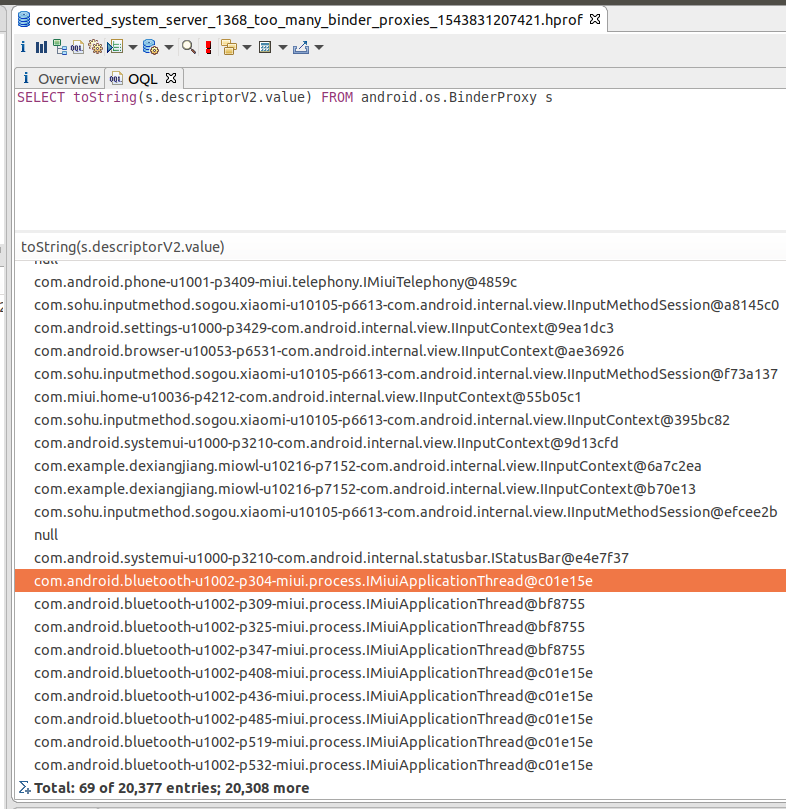
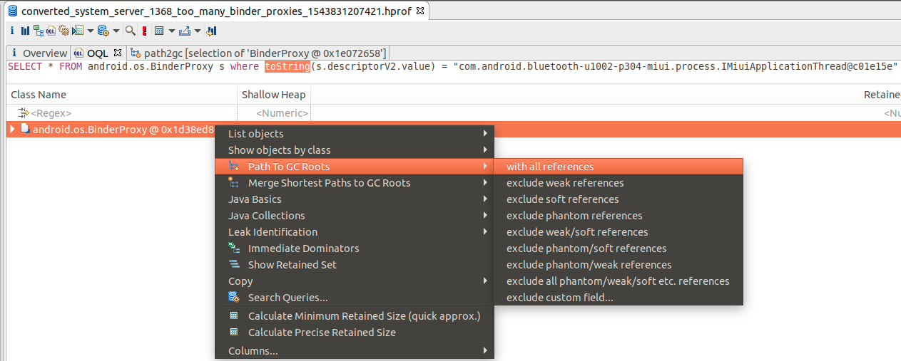
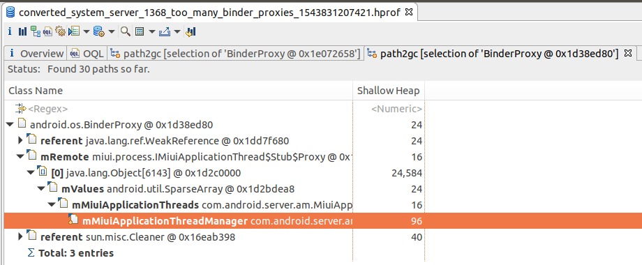
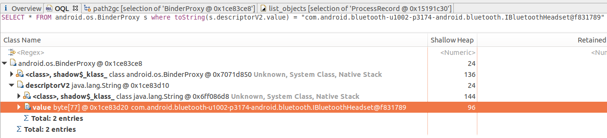
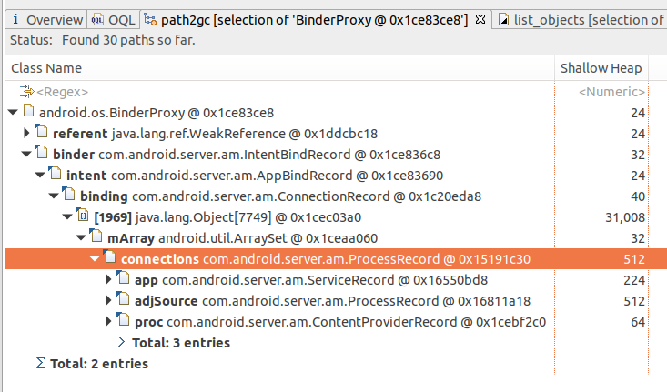
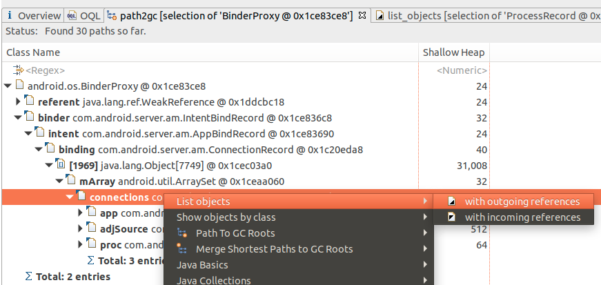
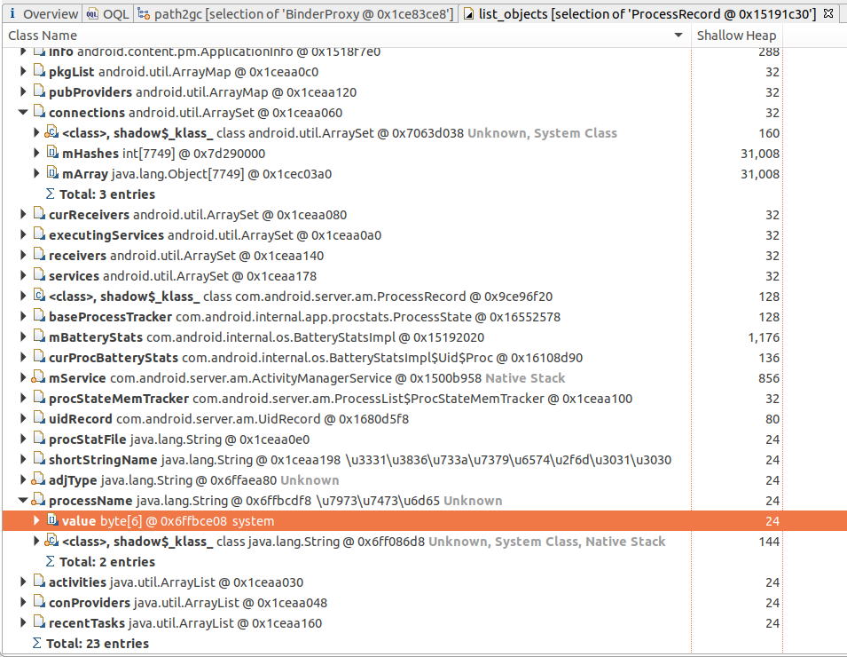

# system_server BinderProxy相关泄露问题记录


记录一下这个问题的分析过程，主要是分享下Eclipse MAT的使用技巧 ：-)

## 问题现象
在长时间的稳定性测试后，经常遇到下面2类错误导致的重启，9.0上遇到的比较多的是这个java层报错：
```java
java.lang.AssertionError: Binder ProxyMap has too many entries: 20440 (total), 20272 (uncleared), 20176 (uncleared after GC). BinderProxy leak?
```
而8.0上报的都是下面这个global reference overflow的NE问题：
```c++
pid: 1505, tid: 2994, name: Binder:1505_B  >>> system_server <<<
signal 6 (SIGABRT), code -6 (SI_TKILL), fault addr --------
Abort message: 'indirect_reference_table.cc:255] JNI ERROR (app bug): global reference table overflow (max=51200)'
```
<!-- more -->

### 问题1：Binder ProxyMap has too many entries
这个错误信息十分清晰，BinderProxy实例的数量太多，在执行一次gc后，system_server进程依然有20176个存活的BinderProxy对象。

仔细再看下异常调用栈：

```
at android.os.BinderProxy$ProxyMap.set(Binder.java:951)
at android.os.BinderProxy.getInstance(Binder.java:1078)
at android.os.Parcel.nativeReadStrongBinder(Native Method)
at android.os.Parcel.readStrongBinder(Parcel.java:2035)
at android.app.IActivityManager$Stub.onTransact(IActivityManager.java:480)
at com.android.server.am.ActivityManagerService.onTransact(ActivityManagerService.java:3383)
at android.os.Binder.execTransact(Binder.java:733)
```

```java
final class BinderProxy implements IBinder {
    // called from native code
    private static BinderProxy getInstance(long nativeData, long iBinder) {
        BinderProxy result = sProxyMap.get(iBinder);
        if (result != null) {
            return result;
        }
        result = new BinderProxy(nativeData);
        sProxyMap.set(iBinder, result);
        return result;
    }
 
    private static final class ProxyMap {
        void set(long key, @NonNull BinderProxy value) {
            ...
            if (size >= mWarnBucketSize) {
                final int totalSize = size();
                mWarnBucketSize += WARN_INCREMENT;
                if (Build.IS_DEBUGGABLE && totalSize >= CRASH_AT_SIZE) {
                    // Use the number of uncleared entries to determine whether we should
                    // really report a histogram and crash. We don't want to fundamentally
                    // change behavior for a debuggable process, so we GC only if we are
                    // about to crash.
                    final int totalUnclearedSize = unclearedSize();
                    if (totalUnclearedSize >= CRASH_AT_SIZE) { // CRASH_AT_SIZE = 20000
                        dumpProxyInterfaceCounts();
                        dumpPerUidProxyCounts();
                        Runtime.getRuntime().gc();
                        throw new AssertionError("Binder ProxyMap has too many entries: "
                                + totalSize + " (total), " + totalUnclearedSize + " (uncleared), "
                                + unclearedSize() + " (uncleared after GC). BinderProxy leak?"); // <<<<<<<<<<<<<<<
                ...
}
```

结合代码后，了解到ProxyMap里会存放所有的java层BinderProxy对象，使用的时WeakReference，就是为了内存泄漏，我们知道，当WeakReference自身引用的对象
在没有被其他强引用占用时，WeakReference里的引用的对象就会被虚拟机在下次gc时自动回收掉。
现在既然存在BinderProxy泄漏，那肯定就是system_server进程里某个地方一直在持有着对BinderProxy对象，那么后面排查这个问题，我们就需要解决下面两个问题：

- 这20000多个BinderProxy对象都是哪些进程的Binder对象的代理？
- 谁一直在强引用着这些BinderProxy对象？

### 问题2： global reference table overflow
global reference的详细用途，可以参考[google文档](https://developer.android.com/training/articles/perf-jni#local-and-global-references)，简单来说就是native代码里需要引用java层对象，为了防止被使用的java对象被gc回收掉，需要向虚拟机注册一个全局强引用，这样虚拟机gc时即使发现这个被引用的java对象已经没有其他java层对象持有后，也不会回收这个对象，直到global reference被取消掉，下次gc才可能会回收它；
还有个local reference，一般是在一个jni方法里，临时使用某个java对象时，先注册一个local reference，目的跟global reference是一样的。
这儿system_server进程crash的原因是global reference总的数量超过51200了，正常情况下不会有这么多引用，继续看一下这个详细的错误栈：

```c++
11-19 01:25:50.692  1000 12354 12354 F DEBUG   : backtrace:
11-19 01:25:50.692  1000 12354 12354 F DEBUG   :     #00 pc 0000000000021f34  /system/lib64/libc.so (abort+116)
11-19 01:25:50.692  1000 12354 12354 F DEBUG   :     #01 pc 0000000000465478  /system/lib64/libart.so (art::Runtime::Abort(char const*)+1196)
11-19 01:25:50.692  1000 12354 12354 F DEBUG   :     #02 pc 0000000000008cd4  /system/lib64/libbase.so (android::base::LogMessage::~LogMessage()+724)
11-19 01:25:50.692  1000 12354 12354 F DEBUG   :     #03 pc 00000000002e7438  /system/lib64/libart.so (art::JavaVMExt::AddGlobalRef(art::Thread*, art::ObjPtr<art::mirror::Object>)+304)
11-19 01:25:50.692  1000 12354 12354 F DEBUG   :     #04 pc 000000000032ed7c  /system/lib64/libart.so (art::JNI::NewGlobalRef(_JNIEnv*, _jobject*)+612)
11-19 01:25:50.692  1000 12354 12354 F DEBUG   :     #05 pc 0000000000131b20  /system/lib64/libandroid_runtime.so (JavaDeathRecipient::JavaDeathRecipient(_JNIEnv*, _jobject*, android::sp<DeathRecipientList> const&)+136)
11-19 01:25:50.692  1000 12354 12354 F DEBUG   :     #06 pc 00000000001316a0  /system/lib64/libandroid_runtime.so (android_os_BinderProxy_linkToDeath(_JNIEnv*, _jobject*, _jobject*, int)+160)
...
```

结合BinderProxy.linkToDeath()的代码：
```c++
public class Binder implements IBinder {
...
final class BinderProxy implements IBinder {
    public native void linkToDeath(DeathRecipient recipient, int flags) // <<<<<<<<<<<<< 1
            throws RemoteException;
    ...
}
```

```c++
// frameworks/base/core/jni/android_util_Binder.cpp
static void android_os_BinderProxy_linkToDeath(JNIEnv* env, jobject obj,
        jobject recipient, jint flags) // throws RemoteException
{
    if (recipient == NULL) {
        jniThrowNullPointerException(env, NULL);
        return;
    }
 
    BinderProxyNativeData *nd = getBPNativeData(env, obj);
    IBinder* target = nd->mObject.get();
 
    if (!target->localBinder()) {
        DeathRecipientList* list = nd->mOrgue.get();
        sp<JavaDeathRecipient> jdr = new JavaDeathRecipient(env, recipient, list);
        status_t err = target->linkToDeath(jdr, NULL, flags); // <<<<<<<<<<<<< 2
        ...
    }
}
```

```c++
class JavaDeathRecipient : public IBinder::DeathRecipient
{
public:
    JavaDeathRecipient(JNIEnv* env, jobject object, const sp<DeathRecipientList>& list)
        : mVM(jnienv_to_javavm(env)), mObject(env->NewGlobalRef(object)), // <<<<<<<<<<<<<<<< 3
          mObjectWeak(NULL), mList(list)
    {
        // These objects manage their own lifetimes so are responsible for final bookkeeping.
        // The list holds a strong reference to this object.
        list->add(this);
 
        gNumDeathRefsCreated.fetch_add(1, std::memory_order_relaxed);
        gcIfManyNewRefs(env);
    }
}
```

```c++
// art/runtime/jni_internal.cc
namespace art {
static jobject NewGlobalRef(JNIEnv* env, jobject obj) {
    ScopedObjectAccess soa(env);
    ObjPtr<mirror::Object> decoded_obj = soa.Decode<mirror::Object>(obj);
    return soa.Vm()->AddGlobalRef(soa.Self(), decoded_obj);
}
 
// art/runtime/java_vm_ext.cc
static constexpr size_t kGlobalsMax = 51200;  // Arbitrary sanity check. (Must fit in 16 bits.)
 
jobject JavaVMExt::AddGlobalRef(Thread* self, ObjPtr<mirror::Object> obj) {
  // Check for null after decoding the object to handle cleared weak globals.
  if (obj == nullptr) {
    return nullptr;
  }
  IndirectRef ref;
  std::string error_msg;
  {
    WriterMutexLock mu(self, *Locks::jni_globals_lock_);
    ref = globals_.Add(kIRTFirstSegment, obj, &error_msg);
  }
  if (UNLIKELY(ref == nullptr)) {
    LOG(FATAL) << error_msg;
    UNREACHABLE();
  }
  CheckGlobalRefAllocationTracking();
  return reinterpret_cast<jobject>(ref);
}
```

```c++
// art/runtime/indirect_reference_table.cc
IndirectRef IndirectReferenceTable::Add(IRTSegmentState previous_state,
                                        ObjPtr<mirror::Object> obj,
                                        std::string* error_msg) {
  size_t top_index = segment_state_.top_index;
 
  CHECK(obj != nullptr);
  VerifyObject(obj);
  DCHECK(table_ != nullptr);
 
  if (top_index == max_entries_) {
    if (resizable_ == ResizableCapacity::kNo) {
      std::ostringstream oss;
      oss << "JNI ERROR (app bug): " << kind_ << " table overflow "
          << "(max=" << max_entries_ << ")"
          << MutatorLockedDumpable<IndirectReferenceTable>(*this);
      *error_msg = oss.str();
      return nullptr;
    }
```

global reference泄漏，那么就需要去看一下到底这些引用指向的是谁，aosp原本的逻辑是发生这种情况时会把所有的reference信息输出到logcat里，但是由于logd进程的日志缓冲区有限，等待测试同学发现手机重启后，可能已经过了好一段时间，前面打印的信息早就被冲掉了，不过，还好同事之前进过代码，在系统重启前会把所有的global reference的信息给持久化到了dropbox里，复现后只要检查下/data/system/dropbox目录，我们就能看到：

```bash
Summary:
  41380 of android.os.RemoteCallbackList$Callback (41380 unique instances)
   6506 of java.lang.ref.WeakReference (6506 unique instances)
    696 of android.app.LoadedApk$ServiceDispatcher$DeathMonitor (696 unique instances)
    682 of com.android.server.accounts.AccountManagerService$8 (680 unique instances)
    451 of java.lang.Class (279 unique instances)
    266 of com.android.server.content.ContentService$ObserverNode$ObserverEntry (266 unique instances)
    188 of java.nio.DirectByteBuffer (175 unique instances)
    128 of java.lang.Object[] (6 elements) (128 unique instances)
```

可以确定也是RemoteCallbackList$Callback的问题了，那再看下具体代码：

```java
public class RemoteCallbackList<E extends IInterface> {
    /*package*/ ArrayMap<IBinder, Callback> mCallbacks
            = new ArrayMap<IBinder, Callback>();
    private final class Callback implements IBinder.DeathRecipient {
        final E mCallback;
        final Object mCookie;
 
        Callback(E callback, Object cookie) {
            mCallback = callback;
            mCookie = cookie;
        }
        ...
    }
 
    public boolean register(E callback, Object cookie) {
        synchronized (mCallbacks) {
            if (mKilled) {
                return false;
            }
            // Flag unusual case that could be caused by a leak. b/36778087
            logExcessiveCallbacks();
            IBinder binder = callback.asBinder();
 
            try {
                Callback cb = new Callback(callback, cookie);
                binder.linkToDeath(cb, 0); // <<<<<<<<<<<<<<<<<<
                mCallbacks.put(binder, cb);
                return true;
            } catch (RemoteException e) {
                return false;
            }
        }
    }
```

再回头看下linkToDeath的底层实现，native层的JavaDeathRecipient的构造函数，就比较清楚了，system_server进程的BinderProxy对象注册了太多的死亡回调，导致global reference table爆了，这个问题跟BinderProxy泄漏应该是有关联的，所以接下来只要确认这些BinderProxy具体是谁。

## 增加调试代码，输出BinderProxy详细信息

先看下打印global reference table的代码：

```c++
// art/runtime/reference_table.cc
void ReferenceTable::Dump(std::ostream& os, Table& entries) {
  // 打印最后使用的10个reference实际的类型
  const size_t kLast = 10;
  size_t count = entries.size();
  int first = count - kLast;
  if (first < 0) {
    first = 0;
  }
  os << "  Last " << (count - first) << " entries (of " << count << "):\n";
  Runtime* runtime = Runtime::Current();
  for (int idx = count - 1; idx >= first; --idx) {
    ObjPtr<mirror::Object> ref = entries[idx].Read();
    if (ref == nullptr) {
      continue;
    }
    if (runtime->IsClearedJniWeakGlobal(ref)) {
      os << StringPrintf("    %5d: cleared jweak\n", idx);
      continue;
    }
    if (ref->GetClass() == nullptr) {
      // should only be possible right after a plain dvmMalloc().
      size_t size = ref->SizeOf();
      os << StringPrintf("    %5d: %p (raw) (%zd bytes)\n", idx, ref.Ptr(), size);
      continue;
    }

    std::string className(ref->PrettyTypeOf());

    std::string extras;
    size_t element_count = GetElementCount(ref);
    if (element_count != 0) {
      StringAppendF(&extras, " (%zd elements)", element_count);
    } else if (ref->GetClass()->IsStringClass()) {
      ObjPtr<mirror::String> s = ref->AsString();
      std::string utf8(s->ToModifiedUtf8());
      if (s->GetLength() <= 16) {
        StringAppendF(&extras, " \"%s\"", utf8.c_str());
      } else {
        StringAppendF(&extras, " \"%.16s... (%d chars)", utf8.c_str(), s->GetLength());
      }
    } else if (ref->IsReferenceInstance()) {
      // 指向WeakReference/SoftReference/...对象，则打印被它引用对象类型
      ObjPtr<mirror::Object> referent = ref->AsReference()->GetReferent();
      if (referent == nullptr) {
        extras = " (referent is null)";
      } else {
        extras = StringPrintf(" (referent is a %s)", referent->PrettyTypeOf().c_str());
      }
    }   
    ...
  // 统计每种类型的对象的数量
  os << "  Summary:\n";
  for (SummaryElement& elem : sorted_summaries) {
    ObjPtr<mirror::Object> elemObj = elem.root.Read<kWithoutReadBarrier>();
    DumpSummaryLine(os, elemObj, GetElementCount(elemObj), elem.identical, elem.equiv);
  }
```

BinderProxy.getInterfaceDescriptor()方法，它返回一个描述其信息的字符串，所以只要在上面的代码判断下reference指向对象的类型，如果是BinderProxy的话，则顺便也输出下interfaceDescriptor，而如果是RemoteCallbackList$Callback类型的话，也是一样地输出其内部存储的callback对象的interfaceDescriptor：
```c++
void ReferenceTable::Dump(std::ostream& os, Table& entries) {
    // 打印所有的reference
    const size_t kLast = 51200;
    ...
    std::string CALLBACK_STR = "android.os.RemoteCallbackList$Callback";
    ScopedLocalRef<jclass> classbackClazz(env, env->FindClass(CALLBACK_STR.c_str()));
    jmethodID getCallbackInfo = env->GetMethodID(classbackClazz.get(),
                                       "getCallbackInfo", "()Ljava/lang/String;");
	std::string BINDER_PROXY_TYPE = "android.os.BinderProxy";
	ScopedLocalRef<jclass> binderProxyClazz(env, env->FindClass(BINDER_PROXY_TYPE.c_str()));
	jmethodID getInterfaceDescriptor = env->GetMethodID(binderProxyClazz.get(),
                                                "getInterfaceDescriptorV2", "()Ljava/lang/String;");
	...
    if (ref->IsReferenceInstance()) {
        // 指向WeakReference/SoftReference对象，则打印被它引用的对象类型
        ObjPtr<mirror::Object> referent = ref->AsReference()->GetReferent();
        if (referent == nullptr) {
            extras = " (referent is null)";
        } else {
            extras = StringPrintf(" (referent is a %s)", referent->PrettyTypeOf().c_str());
            if (referent->PrettyTypeOf() == BINDER_PROXY_TYPE) {
                ScopedLocalRef<jobject> binderProxy(env, env_ext->NewLocalRef(referent.Ptr()));
                ScopedLocalRef<jstring> descriptorStr(env,
                    (jstring) (env->CallObjectMethod(binderProxy.get(), getInterfaceDescriptor)));
                if (descriptorStr.get() != nullptr) {
                    const char* descriptorChars = nullptr;
                    descriptorChars = env->GetStringUTFChars(descriptorStr.get(), nullptr);
                    if(descriptorChars) {
                      extras = StringPrintf(" (referent is a %s) ",
                                            referent->PrettyTypeOf().c_str(), descriptorChars);
                      env->ReleaseStringUTFChars(descriptorStr.get(), descriptorChars);
                    }
                }
            }
        }
    } else if (className == CALLBACK_STR) {
            ScopedLocalRef <jobject> callback(env, env_ext->NewLocalRef(ref.Ptr()));
            ScopedLocalRef <jstring> infoStr(env,
                                             (jstring)(env->CallObjectMethod(callback.get(), getCallbackInfo)));
            if (infoStr.get() != nullptr) {
                const char *descriptorChars = nullptr;
                descriptorChars = env->GetStringUTFChars(infoStr.get(), nullptr);
                if (descriptorChars) {
                    extras = StringPrintf(" ( is a %s) ", descriptorChars);
                    env->ReleaseStringUTFChars(infoStr.get(), descriptorChars);
                }
            }
}
```
对应的需要修改下Binder.java和RemoteCallbackList.java等文件，添加如下方法：
```c++
// frameworks/base/core/jni/android_util_Binder.cpp
public interface IBinder {
    /**
     * IBinder protocol transaction code: interrogate the recipient side
     * of the transaction for its canonical interface descriptor.
     */
    int INTERFACE_TRANSACTION   = ('_'<<24)|('N'<<16)|('T'<<8)|'F';
    int INTERFACE_TRANSACTION_V2 = INTERFACE_TRANSACTION + 1;
}
```

```java
// frameworks/base/core/java/android/os/Binder.java
public class Binder implements IBinder {
    
    // 为避免调试代码对正常流程造成影响，增加这个V2方法，而不是用原生的getInterfaceDescriptor，
    // 这样我们可以定制更详细的信息返回值
    public String getInterfaceDescriptorV2() {
 		String descriptor = mDescriptor;
        if (android.text.TextUtils.isEmpty(descriptor)) {
            descriptor = toString();
        } else {
            descriptor += "@" + Integer.toHexString(hashCode());
        }
        String processName = android.app.ActivityThread.currentProcessName();
        if (android.text.TextUtils.isEmpty(processName)) {
            processName = "system_server";
        }
        return processName + "-u" + Process.myUid() + "-p" + Process.myPid() + "-" + descriptor;
    }
    
    private boolean execTransact(int code, long dataObj, long replyObj,
            int flags) {
        if (code == INTERFACE_TRANSACTION_V2) {
            reply.writeString(getInterfaceDescriptorV2());
            res = true;
        } else {
            res = onTransact(code, data, reply, flags);
        }
        ...
    }
    
final class BinderProxy implements IBinder {
        public native String getInterfaceDescriptorV2() throws RemoteException;
...
```

相应的需要在native层增加getInterfaceDescriptorV2()函数

```c++
// frameworks/base/core/jni/android_util_Binder.cpp
static jstring android_os_BinderProxy_getInterfaceDescriptorV2(JNIEnv* env, jobject obj)
{
    IBinder* target = getBPNativeData(env, obj)->mObject.get();
    BpBinder* proxy = reinterpret_cast<BpBinder*>(target);
    if (proxy != NULL) {
        const String16& desc = proxy->getInterfaceDescriptorV2();
        return env->NewString(reinterpret_cast<const jchar*>(desc.string()),
                              desc.size());
    }

    if (target != NULL) {
        const String16& desc = target->getInterfaceDescriptor();
        return env->NewString(reinterpret_cast<const jchar*>(desc.string()),
                              desc.size());
    }
    jniThrowException(env, "java/lang/RuntimeException",
                      "No binder found for object");
    return NULL;
}
// 注册JNI方法
static const JNINativeMethod gBinderProxyMethods[] = {
    ...
 {"getInterfaceDescriptorV2", "()Ljava/lang/String;", (void*)android_os_BinderProxy_getInterfaceDescriptorV2},
```

```java
 // frameworks/base/core/java/android/os/RemoteCallbackList.java
 private final class Callback implements IBinder.DeathRecipient {
     final E mCallback;
     final Object mCookie;

     Callback(E callback, Object cookie) {
         mCallback = callback;
         mCookie = cookie;
     }

     public void binderDied() {
         synchronized (mCallbacks) {
             mCallbacks.remove(mCallback.asBinder());
         }
         onCallbackDied(mCallback, mCookie);

         public String getCallbackInfo() {
             String result = "";
             IBinder binder = mCallback.asBinder();
             if (binder instanceof BinderProxy) {
                 BinderProxy proxy = (BinderProxy) binder;
                 result = proxy.getInterfaceDescriptorV2();
             }
             return result;
         }
     ...
```

OK，一切就续，下面就只要make framework && make libart && make lib_android_runtime, 然后把生成的so文件push到手机上对应的位置后，重启手机，稳定性测试一段事件后，连上debugger，手动执行下Debug.dumpReferenceTables()，发现依然没有打印出来的interfaceDescriptor都是空的，回看上面的BinderProxy.getInterfaceDescriptor()和BinderProxy.getInterfaceDescriptorV2()方法，它们实际都是个binder call，需要ipc到远端进程的调用Binder.getInterfaceDescriptorV2()，所以这儿可能的问题就是远端进程可能早就挂了，这个ipc肯定就失败了。

### 再调整

既然binderProxy对应的远端进程可能会挂掉，那么在远端进程调用system_server的接口，写Binder对象的时候，顺便把它的interfaceDescriptor写入Parcel，一并发送给system_system，然后system_server进程收到binder调用时，把远端app进程的写入的interfaceDescriptor从parcel里反序列化出来，塞进对应的BinderProxy即可。

考虑到system_server会或类似installd, sufaceflinger这类native进程进行binder call，所以像下面这样仅修改Parcel.java#writeStrongBinder()方法，**<font color="red">还不够稳妥</font>**：
```java
public class Binder implements IBinder {
	public final void writeStrongBinder(IBinder val) {
        String desV2 = "";
        if (val instanceof Binder) {
            desV2 = ((Binder)val).getInterfaceDescriptorV2();
        }
        nativeWriteStrongBinder(mNativePtr, val);
        nativeWriteString(mNativePtr, desV2);
    }
    public final IBinder readStrongBinder() {
        IBinder iBinder = nativeReadStrongBinder(mNativePtr);
        String desV2 = nativeReadString(mNativePtr);
        if (iBinder instanceof BinderProxy) {
            ((BinderProxy)iBinder).descriptorV2 = desV2;
        }
        return iBinder;
    }
```

否则可能因为序列化/反序列化时对parcel读写不一致，引入不必要的稳定性问题，那么就得换个方式，改libbinder的底层实现，因为不管是java进程还是native进程实际都是使用的libbinder：
```diff
// frameworks/base/core/jni/android_os_Parcel.cpp
--static void android_os_Parcel_writeStrongBinder(JNIEnv* env, jclass clazz, jlong nativePtr, jobject object)
++static void android_os_Parcel_writeStrongBinder(JNIEnv* env, jclass clazz, jlong nativePtr, jobject object, jstring val)
{
    Parcel* parcel = reinterpret_cast<Parcel*>(nativePtr);
    if (parcel != NULL) {
--        const status_t err = parcel->writeStrongBinder(ibinderForJavaObject(env, object));
++        String16 s16;
++        if (val) {
++            const jchar* str = env->GetStringCritical(val, 0);
++            if (str) {
++                s16 = String16(reinterpret_cast<const char16_t*>(str), env->GetStringLength(val));
++                env->ReleaseStringCritical(val, str);
++            }
++        }
++        const status_t err = parcel->writeStrongBinderV2(ibinderForJavaObject(env, object), s16);
        if (err != NO_ERROR) {
            signalExceptionForError(env, clazz, err);
        }
    }
}

--static jobject android_os_Parcel_readStrongBinder(JNIEnv* env, jclass clazz, jlong nativePtr)
++static jobject android_os_Parcel_readStrongBinder(JNIEnv* env, jclass clazz, jlong nativePtr, jobjectArray stringArray)
{
    Parcel* parcel = reinterpret_cast<Parcel*>(nativePtr);
    if (parcel != NULL) {
--        return javaObjectForIBinder(env, parcel->readStrongBinder());
++        String16 out;
++        jobject obj = javaObjectForIBinder(env, parcel->readStrongBinderV2(&out));
++        if (out.size() > 0) {
++            int stringCount = env->GetArrayLength(stringArray);
++            if (stringCount > 0) {
++                jstring str = env->NewString(reinterpret_cast<const jchar*>(out.string()), out.size());
++                env->SetObjectArrayElement(stringArray, 0, str);
++            }
++        }
++        return obj;
    }
    return NULL;
}

// ----------------------------------------------------------------------------
static const JNINativeMethod gParcelMethods[] = {
--    {"nativeWriteStrongBinder",   "(JLandroid/os/IBinder;)V", (void*)android_os_Parcel_writeStrongBinder},
++    {"nativeWriteStrongBinder",   "(JLandroid/os/IBinder;Ljava/lang/String;)V", (void*)android_os_Parcel_writeStrongBinder},
	...
--    {"nativeReadStrongBinder",    "(J)Landroid/os/IBinder;", (void*)android_os_Parcel_readStrongBinder},
++    {"nativeReadStrongBinder",    "(J[Ljava/lang/String;)Landroid/os/IBinder;", (void*)android_os_Parcel_readStrongBinder},
```

```c++
// frameworks/native/libs/binder/Parcel.cpp
sp<IBinder> Parcel::readStrongBinderV2(String16* outDescriptor) const
{
    sp<IBinder> val;
    readNullableStrongBinder(&val, outDescriptor);
    return val;
}

status_t Parcel::writeStrongBinderV2(const sp<IBinder>& val, const String16& descritorV2)
{
    return flatten_binder(ProcessState::self(), val, this, descritorV2);
}

status_t unflatten_binder(const sp<ProcessState>& proc,
    const Parcel& in, sp<IBinder>* out, String16* outDescriptor)
{
    const flat_binder_object* flat = in.readObject(false);
    if (flat) {
        if (outDescriptor)
            in.readString16(outDescriptor);
        else
            in.readString16();
        switch (flat->hdr.type) {
            case BINDER_TYPE_BINDER:
                *out = reinterpret_cast<IBinder*>(flat->cookie);
                return finish_unflatten_binder(NULL, *flat, in);
            case BINDER_TYPE_HANDLE:
                *out = proc->getStrongProxyForHandle(flat->handle);
                return finish_unflatten_binder(
                    static_cast<BpBinder*>(out->get()), *flat, in);
        }
    }
    return BAD_TYPE;
}
 
status_t flatten_binder(const sp<ProcessState>& /*proc*/,
    const sp<IBinder>& binder, Parcel* out, const String16& interface)
{
    flat_binder_object obj;
 
    if (IPCThreadState::self()->backgroundSchedulingDisabled()) {
        /* minimum priority for all nodes is nice 0 */
        obj.flags = FLAT_BINDER_FLAG_ACCEPTS_FDS;
    } else {
        /* minimum priority for all nodes is MAX_NICE(19) */
        obj.flags = 0x13 | FLAT_BINDER_FLAG_ACCEPTS_FDS;
    }
 
    if (binder != NULL) {
        IBinder *local = binder->localBinder();
        if (!local) {
            BpBinder *proxy = binder->remoteBinder();
            if (proxy == NULL) {
                ALOGE("null proxy");
            }
            const int32_t handle = proxy ? proxy->handle() : 0;
            obj.hdr.type = BINDER_TYPE_HANDLE; // BINDER_TYPE_HANDLE即BpBinder,对应java层的BinderProxy
            obj.binder = 0; /* Don't pass uninitialized stack data to a remote process */
            obj.handle = handle;
            obj.cookie = 0;
        } else {
            obj.hdr.type = BINDER_TYPE_BINDER; // BINDER_TYPE_BINDER即BnBinder，对应java层的Binder
            obj.binder = reinterpret_cast<uintptr_t>(local->getWeakRefs());
            obj.cookie = reinterpret_cast<uintptr_t>(local);
        }
    } else {
        obj.hdr.type = BINDER_TYPE_BINDER;
        obj.binder = 0;
        obj.cookie = 0;
    }
 
    status_t status = finish_flatten_binder(binder, obj, out);
    if (status == NO_ERROR)
        status = out->writeString16(interface);
    return status;
}
```

同样BinderProxy.getInterfaceDescriptorV2()方法，去掉其native关键字，同时删除其对应的jni实现

```java
final class BinderProxy implements IBinder {
    public String descriptorV2 = "";
    public String getInterfaceDescriptorV2() throws RemoteException{
        if (!TextUtils.isEmpty(descriptorV2)) {
            return descriptorV2;
        }
        return "unknown";
    }
   ...
```
*<font color="#666">注：在ipc时，binder驱动在序列化binder时，如果发现操作的是BnBinder对象，即类型是BINDER_TYPE_BINDER的，则实际会写入BINDER_TYPE_HANDLE类型，这样当ipc对端反序列化时，就会构造一个BpBinder对象表示原来的BnBinder对象；如果写入的就是BINDER_TYPE_HANDLE，则binder驱动写入的还是BINDER_TYPE_HANDLE类型。感兴趣的话可以看kernel/drivers/staging/android/Binder.c#binder_transaction() 的实现逻辑</font>*

##  定位泄漏点
重新打包后，压测跑到6000多次，就复现了这个问题，查看转储到dropbox里的global reference table文件：
```bash
BinderProxy diagnosis: total size of 21762
BinderProxy descriptor histogram (top 100):
 #1: <cleared weak-ref> x128
 #2: unknown x48
 #3: com.android.bluetooth-u1002-p4845-android.bluetooth.IBluetoothHeadset@dbb6c2b x3
 #4: com.android.bluetooth-u1002-p19850-android.bluetooth.IBluetoothHeadset@dbb6c2b x3
 #5: com.android.bluetooth-u1002-p30548-android.bluetooth.IBluetoothHeadset@dbb6c2b x3
 #6: com.android.bluetooth-u1002-p10107-android.bluetooth.IBluetoothHeadset@e035221 x3
 #7: com.android.bluetooth-u1002-p8648-android.bluetooth.IBluetoothHeadset@dbb6c2b x3
 #8: com.android.bluetooth-u1002-p27012-android.bluetooth.IBluetoothHeadset@dbb6c2b x3
 #9: com.android.bluetooth-u1002-p2900-android.bluetooth.IBluetoothHeadset@dbb6c2b x3
 #10: com.android.bluetooth-u1002-p12192-android.bluetooth.IBluetoothHeadset@dbb6c2b x2
 #11: com.android.bluetooth-u1002-p20034-android.bluetooth.IBluetoothHidDevice@5c0c317 x2
 #12: com.android.bluetooth-u1002-p9279-android.bluetooth.IBluetoothHeadset@dbb6c2b x2
...
Per Uid Binder Proxy Counts:
UID : 1000  count = 718
UID : 1001  count = 194
UID : 1002  count = 20262 // <<<<<<<<
UID : 1027  count = 21
```

都是指向蓝牙（uid=1002）进程的BinderProxy，同时我在系统crash前也打印了system_server挂掉前的heap profile，所以接下来先借助下Eclipse MAT来统计下所有的BinderProxy

 

*<font color="blue">注：android上通过Debug.dumpHprofData()接口dump下来的hprof文件需要用hprof-con工具手动转一下才能由MAT打开，这个工具位于你下载的android sdk目录，见${android-sdk}/platform-tools/hprof-conv</font>*

展开所有的entry后，点击工具栏的"导出"按钮，再由shell命令排序好后，得到：

| BinderProxy                           | 数量     |
| ------------------------------------- | -------- |
| android.bluetooth.IBluetoothHeadset   | **6583** |
| android.bluetooth.IBluetoothHidDevice | **6518** |
| miui.process.IMiuiApplicationThread   | **6048** |

挑选一个interfaceDescriptor是蓝牙进程的IMiuiApplicationThread的BinderProxy的实例：

```sql
SELECT * FROM android.os.BinderProxy s where toString(s.descriptorV2.value) = "com.android.bluetooth-u1002-p304-miui.process.IMiuiApplicationThread@c01e15e"
```

有泄漏，即它没有被虚拟机回收，那么必定就有>=1的gc 跟节点还（直接或间接）持有这个被泄露的对象的引用，所以再借助MAT来分析有哪些gc根节点指向这个被泄露的对象：

 
 

可以看到这个BinderProxy是被mMiuiApplicationThreads这个SparseArray强引用着，mMiuiApplicationThreads又是被mMiuiApplicationThreadManager引用，它是mMiuiApplicationThreadManager定义在ProcessManagerService.java里mMiuiApplicationThreads这个SparseArray的size是 **6143！**。
结合代码发现了每个进程的启动的时候会向system_server注册一个descriptor为IMiuiApplicationThread的BinderProxy对象，主要用于MIUI的长截屏功能而在进程挂掉的时候，却没有从移除掉，所以就发生泄漏，详细代码枯燥，此处略，这一块属于进程管理相关的，直接通知相关同学进行修复了。

继续定位剩余两个泄漏项，流程跟定位IMiuiApplicationThread泄漏的是一样的：

1、标定一个泄漏的BinderProxy

 

2、查看它的gc roots

 

可以看到它被ProcessRecord.connections这个ArraySet引用着，那么下面再看下这个ProcessRecord是表示的哪个进程：

 

最后得到：
 


**原来是system_server进程的ProcessRecord的问题，注意看connections.mArray的大小，有7749个!**

3、确认代码逻辑：

1. 翻看下对ProcessRecord.connections进行增删的地方，只有binderService和unbindService
2. 到这里我们就可以判定肯定是system_server某个地方有重复绑定IBluetoothHeadset这个代表的service了，去package/apps/bluetooth目录下确认这个类是HeadsetService.java了，最终定位到BluetoothManagerService.java类里确实存在重复bind的情况，具体代码略，另外还确认到BluetoothHidDevice.java逻辑也存在问题，导致压力测试中systemui和com.xiaomi.bluetooth会出现重复bind的情况，已经跟蓝牙同事沟通，由他们进行修复并提交给aosp。

## 继续调查global reference overflow问题
在上面的问题都修复后，9.0上依然有global reference overflow问题，继续测试后确认是桌面频繁调用壁纸接口导致，根本原因是RemoteCallbackList.register方法实现存在问题下面这段代码可以很容易的制造出这个问题：
```java
void testGetCurrentWallpaper() {
    WallpaperManager manager = WallpaperManager.getInstance(this);
    int count = 0;
    while (true) {
        count++;
        BitmapDrawable drawable = null;
        if ((drawable = (BitmapDrawable) manager.getDrawable()) == null) {
            Log.d("WWW", "failed to get wallpaper: seq=" + count);
        } else {
            Log.d("WWW", "got wallpaper: seq=" + count);
            // deprecate cahce
            drawable.getBitmap().recycle();
        }
    }
}
```

提交了修复patch给aosp，*这类小概率问题google的研发一般处理的都不会太积极*

```java

    public boolean register(E callback, Object cookie) {
        synchronized (mCallbacks) {
            IBinder binder = callback.asBinder();
            try {
                Callback cb = new Callback(callback, cookie);
                binder.linkToDeath(cb, 0);
                mCallbacks.put(binder, cb);
                Callback oldDeathRecipient = mCallbacks.put(binder, cb);
                if (oldDeathRecipient != null) {
                    removeRegistration(oldDeathRecipient);
                    try {
                        // Global reference would overflow if the same callback was
                        // registered repeatedly
                        binder.unlinkToDeath(oldDeathRecipient, 0);
                    } catch (NoSuchElementException e) {
                        // Should not happen
                        Slog.d(TAG, "Failed to unregister " + oldDeathRecipient);
                    }
                }
                return true;
            } catch (RemoteException e) {
                return false;
            }
        }
    }
```


## 小结：

内存泄露问题，平时一般都不会太关注，如果是app开发还好点，集成一下leakcannary这类工具，可以做到自动分析activity这类泄露，基本上能把潜在的泄露在外发前就解决掉；但system_server进程有点特殊，除非发生OTA，用户手动重启手机这种情况，它是一直在后台运行的，哪怕有一点泄露，也经不住几周或几个月的累积，积累到一定程度了，就是系统卡顿，app频繁被杀，最终异常重启，影响用户口碑。

