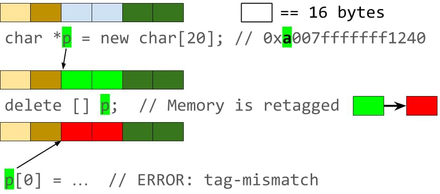

# Android Hardware Assisted Address Sanitizer原理简介


本文介绍Android上定位native代码野指针/数组越界/栈踩踏的强大武器: 
Address Sanitizer(asan)和Hardware assisted Address Sanitizer (hwasan)的基本实现原理

<!-- more -->

# Address Sanitizer

## 基本原理

1. 程序申请的每8bytes内存映射到1byte的shadown内存上
2. 因为malloc返回的地址都是基于8字节对齐的，所以每8个字节实际可能有以下几个状态
   case 1：8个字节全部可以访问，例如`char* p = new char[8];` 将0写入到这8个字节对应的1个字节的shadow内存；
   case 2：前1<=n<8个字节可以访问, 例如`char* p = new char[n]`, 将数值n写入到相应的1字节的shadow内存，尽管这个对象实际只占用5bytes，malloc的实现里[p+5, p+7]这尾部的3个字节的内存也不会再用于分配其他对象，所以通过指针p来越界访问最后3个字节的内存也是被允许的
3. asan还会在程序申请的内存的前后，各增加一个redzone区域（n * 8bytes），用来解决overflow/underflow类问题
4. free对象时，asan不会立即把这个对象的内存释放掉，而是写入1个负数到该对象的shadown内存中，即将该对象成不可读写的状态， 并将它记录放到一个隔离区(book keeping)中, 这样当有野指针或use-after-free的情况时，就能跟进shadow内存的状态，发现程序的异常；一段时间后如果程序没有异常，就会再释放隔离区中的对象
5. 编译器在对每个变量的load/store操作指令前都插入检查代码，确认是否有overflow、underflow、use-after-free等问题

### 检测堆上变量的非法操作的基本实现方式

asan在运行时会替换系统默认的malloc实现，当执行以下代码时，

```c++
void foo() {
  char* ptr = new char[10];
  ptr[1] = 'a';
  ptr[10] = '\n'
}
```

我们知道`new`关键字实际最终调用还是malloc函数，而asan提供的malloc实现基本就如下代码片段所示：

```c++
// asan提供的malloc函数
void* asan_malloc(size_t requested_size) {
    size_t actual_size = RED_ZONE_SIZE /*前redzone*/ + align8(requested_size) + RED_ZONE_SIZE/*后redzone*/;
    // 调用libc的malloc去真正的分配内存
    char* p = (char*)libc_malloc(acutal_size);
    // 标记前后redzone区不可读写
    poison(p, requested_size);

    return p + RED_ZONE_SIZE; // 返回偏移后的地址
}

void foo() {
  // 运行时实际执行的代码
  char* ptr = asan_malloc(10);

  // 编译器插入的代码
  if (isPoisoned(ptr+1)) {
    abort();
  }
  ptr[1] = 'a';

  // 编译器插入的代码
  if (isPoisoned(ptr+10)) {
    abort(); // crash： 访问到了redzone区域
  }
  ptr[10] = '\n'
}
```


asan_malloc会额外多申请2个redzone大小的内存, 实际的内存布局如下所示：

```c++
----------------------------------------------------------------   
|    redzone（前）    |    用户申请的内存      |    redzone(后)    |   
----------------------------------------------------------------
```


用户申请的内存对应的shadow内存会被标记成可读写的，而redzone区域内存对应的shadow内存则会被标记成不可读写的,
这样就可以检测对堆上变量的越界访问类问题了。

### 检测栈上对象的非法操作的基本实现方式

对于以下代码片段

```c++
void foo() {
  char a[8];
  
  a[1] = '\0';
  a[8] = '\0'; // 越界

  return;
}
```


编译器则直接在a数组的前后都插入1个redzone，最终的代码会变成下面的方式：

```c++
void foo() {
  char redzone1[32];  // 编译器插入的代码, 32字节对齐
  char a[8];
  char redzone2[24];  // 编译器插入的代码, 与用于申请的数组a一起做32字节对齐
  char redzone3[32];  // 编译器插入的代码, 32字节对齐

  // 编译器插入的代码
  int  *shadow_base = MemToShadow(redzone1);
  shadow_base[0] = 0xffffffff;  // 标记redzone1的32个字节都不可读写
  shadow_base[1] = 0xffffff00;  // 标记数组a的8个字节为可读写的，而redzone2的24个字节均不可读写
  shadow_base[2] = 0xffffffff;  // 标记redzone3的32个字节都不可读写

  // 编译器插入的代码
  if (isPoisoned(a+1)) {
      abort();
  }
  a[1] = '0';

  // 编译器插入的代码
  if (isPoisoned(a+8)) {
      abort(); // crash: 因为a[8]访问到了redzone区
  }
  a[8] = '\0';

  // 整个栈帧都要被回收了，所以要将redzone和数组a对应的内存都标记成可读可写的
  shadow_base[0] = shadow_base[1] = shadow_base[2] = 0;
  return;
}
```


### 程序申请的对象内存和它的shadow内存映射关系

因为asan对**每8bytes**程序内存会保留**1byte**的shadow内存，所以在进程初始化时，asan得预留(`mmap`)1/8的虚拟内存，
而对于64bit的Linux，实际最大可用虚拟地址是pow(2, 47), 另外要保证预留的地址不会被程序启动时就占用
掉，所以实际预留的地址要再加上一个适当的偏移, 这样就不会与app的申请内存区域重叠，于是有：
`ShadowByteAddr = (AppMemAddr >> 3) + Offset`

------

# Hardware assisted address sanitizer 原理简介

依赖AArch64的address tagging，也叫top byte ignore特性，允许程序将自定义数据存到虚拟地址的最高8位（bit），cpu在操作这个虚拟地址的时候，会自动忽略高8位。

## 基本原理

- 内存对齐：不论是在堆上，栈上分配的对象，还是全局对象，他们的内存起始地址都会做16bytes对齐（malloc或者编译器来保证）

- 标记内存：在分配这些对象时，hwasan挑选一个随机数值tag（<=255），对这个对象做标记，并将它保存到这个对象的对应shadow内存中

- 标记指针：hwasan提供的malloc函数返回的对象虚拟地址的最高8bits也被设置成同样的tag值，栈上对象的标记工作由编译器完成

- 映射关系：每16 bytes程序内存映射到1 byte的shadow内存，用于保存tag值

- 回收对象：重新分配一个随机值，保存对象地址关联的shadow内存中，如果有人使用一个指向一个已经被释放了的对象指针去访问数据，由于tag已经发生了变化，就会被及时检测到

- 检验tag：跟asan类似，在对每个指针的store/load指令前，编译器都插入相应的检查指令，用于确认正在被读或写的指针的高8位上的tag值与指针所指向对象对应的shaow内存里的tag值是一致的，如果出现不一致就会终止当前进程。

  另外，当分配的对象的内存实际小于16字节时，例如我们通过

   

  ```c++
  char* p = new char[10]
  ```

   

  分配一个长度是10byte的char数组，因为要保证每16个字节对应1个字节的shadow byte，所以[p+10, p+15]这6个字节的内存也不会再用于分配其他对象。而这部分预留的闲置内存的最后一个字节就可以用来存放数组的实际大小，这样的话，当检测到指针上的tag与shadow内存里的tag是一致时，还要再校验指针所指向对象的实际大小来检测是否有数组越界问题。

  ```
  char* p = new char[10];
  char* q = p + 11;
  *q = 1; // 数组访问越界
  ```

## 原理图解



## hwasan的漏检率

对一个指针上的保存的tag值，它实际指向的对象所对应的shadow内存里的tag值可能有256（2^8）种可能。那么2个不同的对象就会有1/256，即大约 0.4% 的概率拥有相同tag的情况，这样的野指针/越界方位就不能及时的被检测到，但我们还是可以通过长时间的测试和多次测试来提高检测率。

## hwasan相比asan的优势

- 相比asan，hwsan的shadow memory占用更少（10% ~ 35%）

  hwsan也要对分配的栈/堆上的变量做**16字节对齐\*，还有**每16个字节会占用1个字节的shadow内存**用于保存tag值，但它不再要像asan的实现里那样，在分配的对象前后添加redzone，来检查越界访问，所以内存占用会降低不少。

- **定位对于野指针类问题的概率更高**

  asan只能检测到一个野指针恰好访问的是某个对象之前或之后的redzone内存的情况，理论上redzone越大，能检测到野指针的概率也就越高，不过随之也会带来更大的内存开销(overload)；
  hwsan上，因为两个不同对象的tag值一般是不同的，所以只要是有野指针就能够被及时检测到。


## 参考

1. [AddressSanitizer: A Fast Address Sanity Checker](https://www.usenix.org/system/files/conference/atc12/atc12-final39.pdf)
2. [Detecting Memory Corruption Bugs With HWASan](https://android-developers.googleblog.com/2020/02/detecting-memory-corruption-bugs-with-hwasan.html)
3. [google/sanitizers](https://github.com/google/sanitizers)
4. [Hardware-assisted AddressSanitizer Design Documentation](https://clang.llvm.org/docs/HardwareAssistedAddressSanitizerDesign.html)
