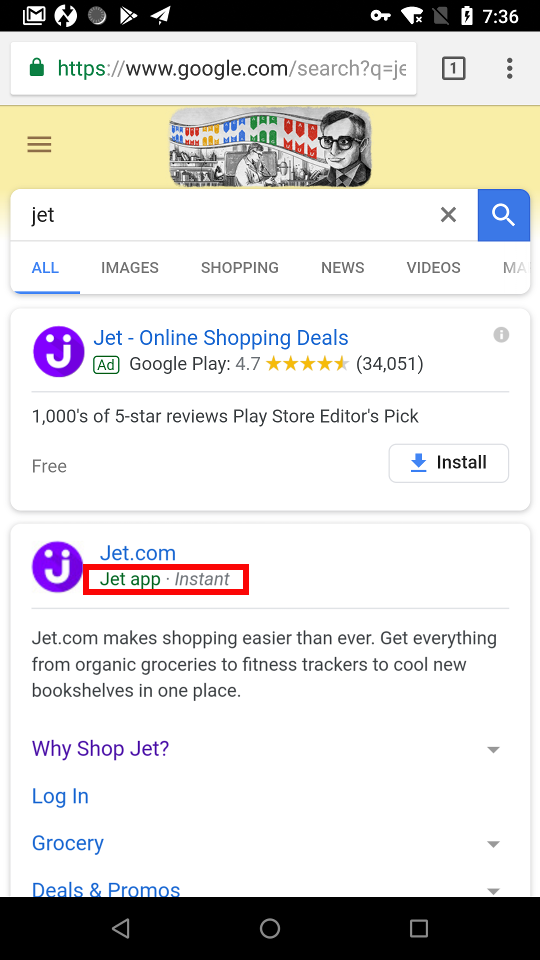
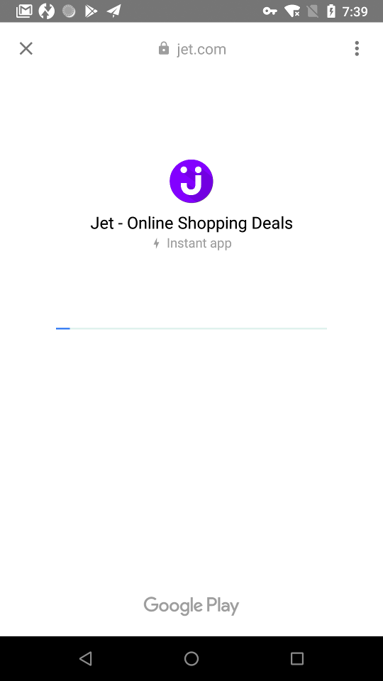
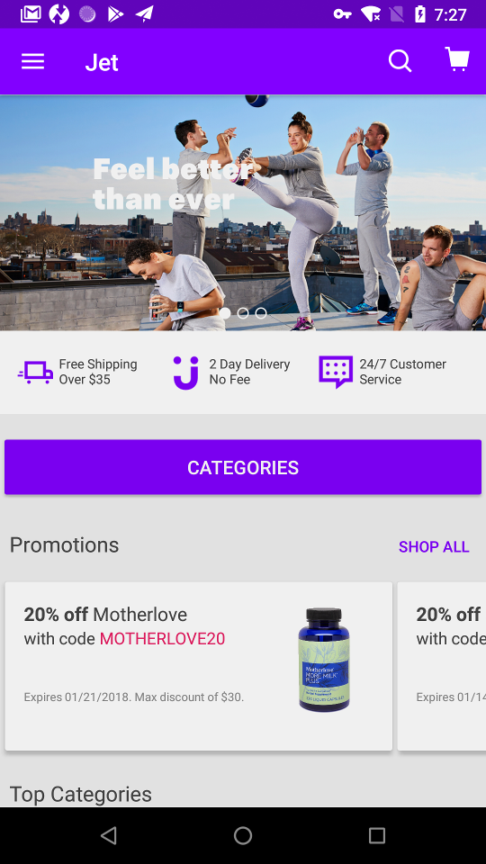
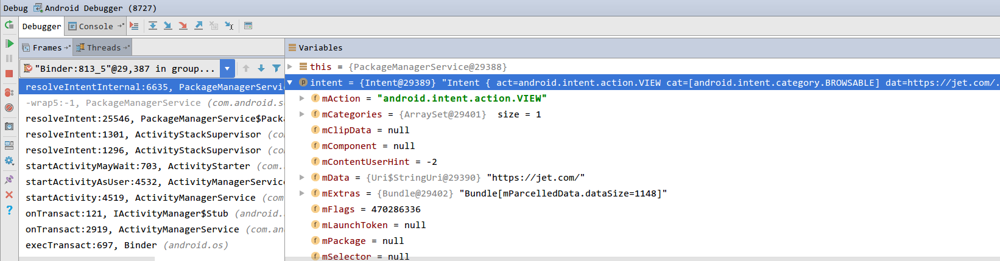

# Android Instant App简介


Instant App中文翻译即“免安装应用”，当点击一个链接时，类似6.0上引入的App Links功能，但更加强大的是，即便用户还没有安装对应的应，也可以直接打相应的应用，从而可以无缝体验原生应用。

<!-- more -->

## 如何体验Instant App

1. 在nexus或pixel 8.0+设备上登录google帐号，进入设置 → Google → Instant apps → 选中之前登录的google帐号 → 系统弹出相关使用协议对话框 → 点击同意

2. 进入chrome, 使用google 搜索 jet（试了下andorid官网说的几个instant app，竟然没有一个可以用的），点击有'**instant**'标注的链接，参考下图：
 <center>
 
 </center>

3. 稍等片刻(网速慢的话会先出现下左图的进度条)，即可进入jet应用（可能不支持大陆地区，这时候你得更新google账户的地区，在Play Store里绑定一个支持visa的信用卡即可）
 <center>
 
 
 </center>


## 如何开发Instant App

请参考 [Getting started with Android Instant Apps](https://developer.android.com/topic/instant-apps/getting-started/index.html)，android studio 3.0支持良好，此处略

## Framework的实现

###  安装流程

在resolveIntent()的地方加了一个断点，然后点击那个带有instant标注的链接，这时chrome没有直接处理这个url，而是把你点击的链接封装成一个intent，通过startActivityIfNeed()调用让系统负责处理它



点击evaluate expression那个按钮(上图第一行最后一个按钮)，执行Binder.getCallingUid()可以获取到对端进程的uid为10017，然后通过getPackagesForUid(uid)也可以确认调用就是chrome

```bash
$ adb shell dumpsys package com.android.chrome
Packages:
Package [com.android.chrome] (85fb650):
userId=10017
pkg=Package{bfce98e com.android.chrome}     codePath=/data/app/com.android.chrome--q5-0Pq30E_mdBwuC9yI9Q== ...
```

这时，系统会额外执行一些验证流程（TL;DR;）后，然后发现这个url是有对应的instant app可以使用的，于是就返回EphemeralInstallerActivity给调用方，最终打开它来下载和安装相应的instant app，参考：

```java
private void setUpInstantAppInstallerActivityLP(ActivityInfo installerActivity) {
    ...
    // Set up information for ephemeral installer activity
    mInstantAppInstallerActivity = installerActivity;
    mInstantAppInstallerActivity.flags |= ActivityInfo.FLAG_EXCLUDE_FROM_RECENTS
            | ActivityInfo.FLAG_FINISH_ON_CLOSE_SYSTEM_DIALOGS;
    mInstantAppInstallerActivity.exported = true;
    mInstantAppInstallerActivity.enabled = true;
    mInstantAppInstallerInfo.activityInfo = mInstantAppInstallerActivity;
    mInstantAppInstallerInfo.priority = 0;
    mInstantAppInstallerInfo.preferredOrder = 1; // <<<<<<<<<<<<<<<<<<<<<<<<< 一般其他app的都为0
    mInstantAppInstallerInfo.isDefault = true;
    mInstantAppInstallerInfo.match = IntentFilter.MATCH_CATEGORY_SCHEME_SPECIFIC_PART
            | IntentFilter.MATCH_ADJUSTMENT_NORMAL;
}

private ResolveInfo chooseBestActivity(Intent intent, String resolvedType,
        int flags, List<ResolveInfo> query, int userId) {
    if (query != null) {
        final int N = query.size();
        if (N == 1) {
            return query.get(0);
        } else if (N > 1) {
            final boolean debug = ((intent.getFlags() & Intent.FLAG_DEBUG_LOG_RESOLUTION) != 0);
            // If there is more than one activity with the same priority,
            // then let the user decide between them.
            // If the first activity has a higher priority, or a different
            // default, then it is always desirable to pick it.
            if (r0.priority != r1.priority
                    || r0.preferredOrder != r1.preferredOrder // <<<<<<<<<<<<<<<<<<<<<<<<<<<<<<<<<< hit
                    || r0.isDefault != r1.isDefault) {
                return query.get(0);
            }
		...
}
```

```
01-12 07:24:11.657 813-2282/system_process I/ActivityManager: START u0 {act=android.intent.action.VIEW cat=[android.intent.category.BROWSABLE] dat=https://jet.com/... flg=0x1c080000 cmp=com.android.vending/com.google.android.finsky.instantapps.EphemeralInstallerActivity (has extras)} from uid 10017 (可以看到调用方是google chrome)
```

```
// google playstore的AndroidManifest.xml
<activity 
    finsky:name="com.google.android.finsky.instantapps.EphemeralInstallerActivity"
    finsky:process=":instant_app_installer" 
    finsky:taskAffinity=":instant_app_installer" 
    finsky:launchMode="singleInstance" >
    <intent-filter>
        <action finsky:name="android.intent.action.INSTALL_INSTANT_APP_PACKAGE" />
        <category finsky:name="android.intent.category.DEFAULT" />
        <data finsky:scheme="file" />
        <data finsky:mimeType="application/vnd.android.package-archive" />
    </intent-filter>  
</activity>
```

### instant app的安装代码实现与PackageInstallerActivity基本相同，都是：

- 通过**PackageManager.getPackageInstaller()**获取到PckageInstanllerService的binder proxy对象，
- 通过 **openSesstion()** 这个binder call到system server端的PackageInstallerService，PackageInstallerService负责创建一个PackageInstallerSession这个binder实例，并返回
- 通过获取到的IpackageInstallerSesstion这个binder proxy再通过 **openWrite()** 让服务端创建一个socket pair，并拿到对应的client socket的文件描述符(fd)，接着就是通过这个socket fd
  把intant app的apk文件写入到system server端，system server端会负责接受文件流，并写入到/data/app/下的一个临时文件里；
- 接下来就是走完PackageManagerServerice的installPackage流程，这里相比普通app有会几点不同：
   instant app不能安装在外置存储上
   target sdk version 需8.0+，target sandbox version 需2+
   安装时不进行dex2oat操作（避免安装时间太长，影响体验），bg dexopt服务也不会对它做优化（存活时间可能比较短，没必要优化） 
   不能自定义权限(组)
   不能用instant app替换已存在的相同包名的非instant app版本（反过来是可以）
   磁盘空间不足时，instant app可能会被移除掉

### 运行instant app

```bash
01-12 07:47:39.436 813-825/system_process I/ActivityManager: START u0 {act=android.intent.action.VIEW cat=[android.intent.category.BROWSABLE] dat=https://jet.com/... flg=0x1c080000 cmp=com.jet.jet.app/com.jet.baselib.activities.RootActivity (has extras)} from uid 10017
```

jet安装成功后，chrome会再发出上面的intent来让系统处理这个url，这个时候查询到有jet这个app可以handle这个app，于是jet应用就被成功拉起来了；

Q：安装了多个浏览器时，任意的浏览器其实都可以处理https://www.jet.com，为什么可以直接进入jet，而不是其他的浏览器app？

A：因为jet app最匹配https://www.jet.com这个URL

参考IntentFilter的匹配intent的流程：

```java
public final int matchData(String type, String scheme, Uri data) {
    if (schemes != null) {
        if (schemes.contains(scheme != null ? scheme : "")) {
            match = MATCH_CATEGORY_SCHEME; // 0x0200000 1. 先匹配scheme, 例如http/https或其他自定义scheme
        } else {
            return NO_MATCH_DATA; 
        }

        final ArrayList<PatternMatcher> schemeSpecificParts = mDataSchemeSpecificParts;
        if (schemeSpecificParts != null && data != null) {
            match = hasDataSchemeSpecificPart(data.getSchemeSpecificPart())
                    ? MATCH_CATEGORY_SCHEME_SPECIFIC_PART : NO_MATCH_DATA;
        }
        if (match != MATCH_CATEGORY_SCHEME_SPECIFIC_PART) {
            // If there isn't any matching ssp, we need to match an authority.
            final ArrayList<AuthorityEntry> authorities = mDataAuthorities;
            if (authorities != null) {
                int authMatch = matchDataAuthority(data);
                if (authMatch >= 0) {
                    final ArrayList<PatternMatcher> paths = mDataPaths;
                    if (paths == null) {
                        match = authMatch;
                    } else if (hasDataPath(data.getPath())) { // 2. 再检查是否有更加匹配的path
                        match = MATCH_CATEGORY_PATH; // 0x0500000
            ...
            }
        }
       ...
    } 
    if (types != null) {
        if (findMimeType(type)) {
            match = MATCH_CATEGORY_TYPE; // 0x0600000  3. 最后再匹配mime类型
        } else {
            return NO_MATCH_TYPE;
        }
    }

    return match + MATCH_ADJUSTMENT_NORMAL;
}
```

后续流程参考chooseBestActivity() → findPreferredActivity()，不赘述

### 运行时的限制

1. instant app无法查询到非instant app里声明的组件，除非是下面两种情况：
   <pre>
  1) 显示声明了组件可以被instant app查询到，即标签上增加了"android:visibleToInstantApps=true"；
  2) 未显示申明visibleToInstantApps，但是该组件是Activity/Service，且其intent filter包含category_browsable/action_send(to)/action_send_multiple中任意一个；
   </pre>
2. 非instant app无法查询instant app的组件
3. 目前不支持发送通知
4. 不允许动态加载native/java code
5. 不支持静态注册的receiver，不支持定义或访问其他app的ContentProvider，service不能长期运行

## 小结

优点：
1. 无需手动安装app，(**浏览器里**)点击链接即可进入原生app
2. 基本和普通app一致的开发流程，模块化开发

缺点：
1. 依赖google play store, gms, chrome等服务，政策原因，国内用不了*~_~||*
2. 目前支持的应用特别少
3. app开发要维护两个版本的代码

