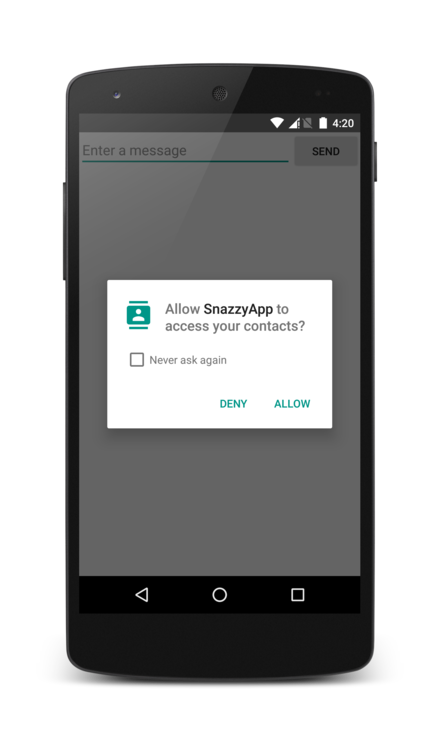

# Android PKMS 权限管理介绍


本文介绍Android PackageManagerService对应用权限的管理

<!-- more -->

### 应用安装时PKMS对权限的处理

**先回顾下app安装流程**：

```bash
→ installPackageLI（安装app，入口函数）
    → installNewPackageLI（安装一个全新的app，即以前未安装过）
    → parsePackage (解析AndroidManifest.xml：构建Activity/Service/ContentProvider/BroadcastReceiver运行时对象...)
    → scanPackageLI (收集证书/校验签名，dex2oat优化，创建app数据目录，释放so文件，分类规整四大组件...)
    → updateSettingsLI（更新/持久化app信息） 
         → updatePermissionsLPw（更新权限信息，例如移除一些已经不存在的系统或app自定义的权限）
              → grantPermissionsLPw（授予app申请的权限）
    → （发送package add/change广播） 结束 
```


```java
// 文件位置：frameworks/base/service/core/java/com/android/server/pm/PackageManagerService.java
private void grantPermissionsLPw(PackageParser.Package pkg, boolean replace,
        String packageOfInterest) {
    final PackageSetting ps = (PackageSetting) pkg.mExtras;
    final GrantedPermissions gp = ps.sharedUser != null ? ps.sharedUser : ps;
    ArraySet<String> origPermissions = gp.grantedPermissions;
    boolean changedPermission = false;
    final int N = pkg.requestedPermissions.size();
    for (int i=0; i<N; i++) {
        final String name = pkg.requestedPermissions.get(i);
        final boolean required = pkg.requestedPermissionsRequired.get(i);
        final BasePermission bp = mSettings.mPermissions.get(name);
        final String perm = bp.name;
        boolean allowed;
        boolean allowedSig = false;
        ...
        final int level = bp.protectionLevel & PermissionInfo.PROTECTION_MASK_BASE;
        if (level == PermissionInfo.PROTECTION_NORMAL
                || level == PermissionInfo.PROTECTION_DANGEROUS) {
            allowed = (required || origPermissions.contains(perm) // 必须的(即AndroidManifest里没有手动声明required=false) or 之前的版本已经拥有该权限 or 咩有自升级过的系统app
                    || (isSystemApp(ps) && !isUpdatedSystemApp(ps)));
        } else if (bp.packageSetting == null) {
            // This permission is invalid; skip it.
            allowed = false;
        } else if (level == PermissionInfo.PROTECTION_SIGNATURE) { // 如果app申请的权限是签名级保护的，
            allowed = grantSignaturePermission(perm, pkg, bp, origPermissions); // 则需要校验定义该权限的app与当前这个app的签名是否相同
            if (allowed) {
                allowedSig = true;
            }
        } else {
            allowed = false;
        }
        if (allowed) {
            ...
                if (!gp.grantedPermissions.contains(perm)) {
                    changedPermission = true;
                    gp.grantedPermissions.add(perm);        // 更新该app已获取到的权限列表
                    gp.gids = appendInts(gp.gids, bp.gids); // 更新该app可以加入的gid
                } else if (!ps.haveGids) {
                    gp.gids = appendInts(gp.gids, bp.gids);
                }
        } else {
            if (gp.grantedPermissions.remove(perm)) {
                changedPermission = true;
                gp.gids = removeInts(gp.gids, bp.gids); // revoke此项权限
            }
...
}
```
因为不管是安装一个全新的app，还是更新一个已安装的app，最后都会调用到grantPermissionsLPw这个方法，
这个方法逻辑其实较简洁，就是遍历新app中声明的权限列表，更新已有的权限列表，和gid数组，删除掉已经不再需要的权限和gid
另外可以参考下面三个文件，：

|文件|功能|
|---|----|
|android/os/Process.java#getGidForName(name) |根据gid名称查询gid value |
|/frameworks/base/data/etc/platform.xml | 定义权限名称 与 gid 名称的映射关系|
|/system/core/.../android_filesystem_config.h | 定义uid/gid名称和值的映射|

**接着，再看下校验app是否拥有某项权限的流程:**

这一步也很简单，如果调用方是个普通app的话，只要检查下这个app的已授予的权限列表里不是包含请求的权限即可；如果调用方是media，cameraserver，audioserver这类系统用户的话，他们的权限是预先就定好的，参考/frameworks/base/data/etc/platform.xml，开机时会解析到mSystemPermissions这个map里，所以这时便可直接从这个map里拿到对应uid拥有的权限列表，如果包含了参数permName，则uid拥有了这个权限；反之，则表明该uid无此权限。

```java
// 文件位置：frameworks/base/services/core/java/com/android/server/pm/PackageManagerService.java
public int checkUidPermission(String permName, int uid) {
    synchronized (mPackages) {
        Object obj = mSettings.getUserIdLPr(UserHandle.getAppId(uid));
        if (obj != null) {
            GrantedPermissions gp = (GrantedPermissions)obj;
            if (gp.grantedPermissions.contains(permName)) {
                return PackageManager.PERMISSION_GRANTED;
            }
        } else {
            HashSet<String> perms = mSystemPermissions.get(uid);
            if (perms != null && perms.contains(permName)) {
                return PackageManager.PERMISSION_GRANTED;
            }
        }
    }
    return PackageManager.PERMISSION_DENIED;
}
```

从上面的代码可以看到，AMS在创建app进程的时候，将app拥有的gids给一并传递给了zygote进程，等zygote fork出子进程后，会通过setgroups系统调用把传过来的gids设置到新的进程上，于是这个新的进程就获得了相应的权限。

### 其他类型的权限

除了基于gid实现的权限控制，还有很多其他的权限的控制，Android没有通过gid来控制，而是让这些权限的owner自己去检验调用方app是否已经被系统授予了这类权限，例如下面获取地理位置信息和打开相机这两个例子；

### 案例1，获取地理位置过程中权限的校验过程

1）通过gps拿到地理位置信息

```java
public void getLastKnownGpsLocation() {
    LocationManager lm = (LocationManager) getApplicationContext().getSystemService(LOCATION_SERVICE);
    Location location = lm.getLastKnownLocation(LocationManager.GPS_PROVIDER);
}
```

2）ipc进入system_server进程，调用LocationManagerService的getLastLocation()

```
// frameworks/base/location/java/android/location/LocationManager.java
public Location getLastKnownLocation(String provider) {
    checkProvider(provider);
    String packageName = mContext.getPackageName();
    LocationRequest request = LocationRequest.createFromDeprecatedProvider(
            provider, 0, 0, true);
    try {
        return mService.getLastLocation(request, packageName);
    } catch (RemoteException e) {
        throw e.rethrowFromSystemServer();
    }
}
```

1) LocationManagerService.getLastLocation()首先会验证调用方是否拥有访问位置信息的权限，最终调用到

文章一开始介绍的PKMS.checkUidPermission()方法，进行校验，如果调用方app的确拥有此权限，那么就会进行后续流程，并最终返回gps位置给调用方；否则，就直接返回null。

```
// frameworks/base/services/core/java/com/android/server/LocationManagerService.java
@Override
public Location getLastLocation(LocationRequest request, String packageName) {
    ...
    final int pid = Binder.getCallingPid();
    final int uid = Binder.getCallingUid();
    final long identity = Binder.clearCallingIdentity();
    try {
        ...
        if (!reportLocationAccessNoThrow(pid, uid, packageName, allowedResolutionLevel)) {
            if (D) Log.d(TAG, "not returning last loc for no op app: " +
                    packageName);
            return null;
        }
...
}
 
boolean reportLocationAccessNoThrow(
        int pid, int uid, String packageName, int allowedResolutionLevel) {
    ...
    if (getAllowedResolutionLevel(pid, uid) < allowedResolutionLevel) {
        return false;
    }
    return true;
}
 
private int getAllowedResolutionLevel(int pid, int uid) {
    if (mContext.checkPermission(android.Manifest.permission.ACCESS_FINE_LOCATION,
            pid, uid) == PackageManager.PERMISSION_GRANTED) {
        return RESOLUTION_LEVEL_FINE;
    } else if (mContext.checkPermission(android.Manifest.permission.ACCESS_COARSE_LOCATION,
            pid, uid) == PackageManager.PERMISSION_GRANTED) {
        return RESOLUTION_LEVEL_COARSE;
    } else {
        return RESOLUTION_LEVEL_NONE;
    }
}
```

ContextImpl.checkPermission() → AMS.checkPermission() → AMS.checkComponentPermission() → PKMS.checkUidPermission()
这一系列调用实现都比较简单，不再赘述。

### 案例2，打开相机
1）Camera.open()的调用流程

```c++
→ Camera.open()    // frameworks/base/core/java/android/hardware/Camera.java
    → android_hardware_Camera_native_setup()    // frameworks/base/core/jni/android_hardware_Camera.cpp
        → Camera::connect()    // frameworks/av/camera/Camera.cpp
            → CameraBase::connect()    // frameworks/av/camera/CameraBase.cpp
                → BpCameraService::connect()    // frameworks/av/camera/ICameraService.cpp
                    → BpBinder.transact()    // frameworks/native/libs/binder/BpBinder.cpp
                        → CameraService.onTransact()
```

```c++
// frameworks/av/services/camera/libcameraservice/CameraService.cpp

status_t CameraService::onTransact(uint32_t code, const Parcel& data, Parcel* reply, uint32_t flags) {
    // Permission checks
    switch (code) {
        case BnCameraService::CONNECT:
        case BnCameraService::CONNECT_PRO:
        case BnCameraService::CONNECT_DEVICE:
        case BnCameraService::CONNECT_LEGACY:
            const int pid = getCallingPid();
            const int self_pid = getpid();
            if (pid != self_pid) {
                 // 校验调用方是否拥有打开相机的权限
                if (!checkCallingPermission(String16("android.permission.CAMERA"))) {
                    return PERMISSION_DENIED;
                }
            }
...
}
```

从上面代码可看到，只有调用方app拥有了打开相机的权限，才会进行后续的初始化操作，否则就直接返回了。

```c++
// frameworks/native/libs/binder/IServiceManager.cpp
static String16 _permission("permission");
 
bool checkPermission(const String16& permission, pid_t pid, uid_t uid)
{
        if (pc != NULL) {
            // ipc调用system_server的PermissionController服务进行校验
            bool res = pc->checkPermission(permission, pid, uid);
            if (res) {
                return res;
            }
            ...
        }
    	// 获取PermissionController的binderProxy对象
        sp<IBinder> binder = defaultServiceManager()->checkService(_permission); 
        pc = interface_cast<IPermissionController>(binder);
}
```

先获取PermissionController的binder proxy对象，然后ipc最终调用到前面提到的PackManagerService.checkUidPermission方法中。

```java
// frameworks/base/core/java/com/android/server/am/ActivityManagerService.java
public void setSystemProcess() {
    try {
        ServiceManager.addService("permission", new PermissionController(this));
        ...
}
 
static class PermissionController extends IPermissionController.Stub {
    @Override
    public boolean checkPermission(String permission, int pid, int uid) {
        return mActivityManagerService.checkPermission(permission, pid,
                uid) == PackageManager.PERMISSION_GRANTED;
    }
}
```

AMS.checkPermission() → AMS.checkComponentPermission() → ActivityManager.chceckComponentPersission() → PKMS.checkUidPermission()

## Android 6.0+的变化

Android 6.0开始引入运行时权限的概念，将系统权限分成了[Normal](https://developer.android.com/guide/topics/permissions/normal-permissions.html)和Dangerous两个大类，其中 [Normal权限](https://developer.android.com/guide/topics/permissions/normal-permissions.html)包含了网络，震动，NFC，指纹，传感器等等，Dangerous权限包含了读写外置存储，打开相机，蓝牙，定位，短信，电话，联系人等等;
对于Dangerous类的权限，也叫做运行时权限，不会再像以前版本那样安装时系统直接授予app，而是后面使用过程中让用户自己选择是否要授予app这类权限；
而对于Normal类的权限，跟6.0前的版本上保持一致，只要app的Manifest里声明了权限，在安装的时候便会授予。
这个新feature给开发者带来一些麻烦，就是每次要使用到危险类的权限时，例如打开相机，开启录音时，都需要先检查自己的app是否拥有了，如果没有就要先请求用户授权，然后才能继续。

### 检查app是否拥有某些权限

通过Context.checkSelfPermission(String permission)可以查询到调用方app是否被被用户授予了参数permission，这个方法也是通过ipc最终调用到system_server进程的PackageManagerService.checkUidPermission()方法进行实际的校验工作.

### 请求用户授权 

通过Activity.requestPermissions(String[] permissions, int requestCode)请求用户授予参数permissions列表，系统会弹出下图所示的弹框，让用户选择允许或拒绝申请的权限：



当用户选择了拒绝或者允许后，在Activity.onRequestPermissionsResult(int requestCode, String[] permissions, int[] grantResults）会接受到用户选择的的结果；
请注意上图里面的个"Nerver ask again"选项，如果用户勾选了它，并且点击拒绝按钮，那么后面再调用Activity.requestPermissions()系统就不会再弹出这个框，让用户选择了，而是直接就回调Activity.onRequestPermissionsResult()，参数grantResults里的值全部为PERMISSION_DENIED，framework针对这种情况也提供了Activity.shouldShowRequestPermissionRationale(String permission)这个接口，如果用户之前有拒绝过app请求的这个权限，那么会返回true，此时app再申请相同的权限的时可以先显示一个UI，跟用户解释一下需要这个权限的原因，然后再调用Activity.requestPermissions()接口，弹出上图里的对话框；

如果之前没有申请过这个权限，或者以前申请过并被用户授予了，但是用户后面又在系统设置里收回了这个权限，那么这个接口返回的是false；但是，如果用户之前有选择拒绝，并且勾选了"Nerever ask again"选项的话，shouldShowRequestPermissionRationale()接口返回的就是false了，这时候就比较尴尬了，因为你无法区分之前是不是有申请过这个权限，并且被用户决绝过了 ，只能直接调用Activity.requestPermissions()接口，然后在系统返回请求结果的回调方法里才能了解到用户拒绝了这个权限，并且已经勾选了"Never ask again"选项（因为没有弹出上图里的弹框）-_-||，下次再请求的时候就可以先显示一个解释说明的UI，引导用户去勾选要的权限，再帮用户导航到系统设置界面，让用户去操作。

### 案例分析：app运行期间，系统如何实现赋予和回收读写sd卡的权限？

6.0以前，sd卡文件读写是通过用户组来实现的，6.0上这个权限变成了运行时权限，那系统是如何实现不重启app进程的情况下赋予它读写sd卡文件权限的呢？
当授予一个app读写sd文件权限的时候，大致是下面这个调用流程：
// SystmServer进程
→ PackageManagerService.grantRuntimePermission()
 → StorageManagerService.onExternalStoragePolicyChanged() 
  → remountUidExternalStorage() → NativeDaemonConnector.execute("remote_uid") 

// vold进程
→ SocketListener::runListener()
 → FrameworkListener::onDataAvailable() 
  → FrameworkListener::dispatchCommand() 
   → CommandListener::VolumeCmd::runCommand()
     → VolumeManager::remountUid()

跳过中间步骤，直接看下remountUid()函数的实现:

```c++
// system/vold/VolumeManager.cpp
int VolumeManager::remountUid(uid_t uid, const std::string& mode) {
    LOG(DEBUG) << "Remounting " << uid << " as mode " << mode;
    DIR* dir;
    struct dirent* de;
    char rootName[PATH_MAX];
    char pidName[PATH_MAX];
    int pidFd;
    int nsFd;
    struct stat sb;
    pid_t child;
 
    if (!(dir = opendir("/proc"))) {
        PLOG(ERROR) << "Failed to opendir";
        return -1;
    }
 
    // Poke through all running PIDs look for apps running as UID
    while ((de = readdir(dir))) {
        pidFd = -1;
        nsFd = -1;
        pidFd = openat(dirfd(dir), de->d_name, O_RDONLY | O_DIRECTORY | O_CLOEXEC);
        ... //
        // We purposefully leave the namespace open across the fork
        nsFd = openat(pidFd, "ns/mnt", O_RDONLY); // not O_CLOEXEC
   
        if (!(child = fork())) { // fork一个子vold进程
            // 把新fork出的vold进程加入nsFd所指的mount namespace，
            // 便于让uid下的进程和这个子vold进程可以共享(mount/unmount)挂载点
            if (setns(nsFd, CLONE_NEWNS) != 0) { 
                _exit(1);
            }
 
            unmount_tree("/storage"); // 卸载当前的/storage挂载点
 
            std::string storageSource;
            if (mode == "default") {
                storageSource = "/mnt/runtime/default"; // sdcard_rw组用户可读写，owner为root
            } else if (mode == "read") {
                storageSource = "/mnt/runtime/read"; // 所有用户可读，owner为root
            } else if (mode == "write") {
                storageSource = "/mnt/runtime/write"; // 所有用户可读写，owner为root
            }
            // 绑定/storage到/mnt/runtime/xxxx目录上，即拥有相同的inode
            // 然后在/storage上就可以看见/mnt/runtime/xxx/目录里的文件了
            if (TEMP_FAILURE_RETRY(mount(storageSource.c_str(), "/storage",
                    NULL, MS_BIND | MS_REC, NULL)) == -1) {                 
                _exit(1);
            }
            // 给/storage设置slave标识后，当插上外置存储卡时，绑定到这个目录的其他挂载点
			// 也可以看到/storage下新挂载的存储
            if (TEMP_FAILURE_RETRY(mount(NULL, "/storage", NULL, 
                    MS_REC | MS_SLAVE, NULL)) == -1) {           
                _exit(1);
            }
 
            // Mount user-specific symlink helper into place
            userid_t user_id = multiuser_get_user_id(uid);
            std::string userSource(StringPrintf("/mnt/user/%d", user_id));
            // 绑定/storage/self到/mnt/user/{userid}上，即拥有相同的inode
            // 然后就可以在/storage/self/下访问/mnt/user/{userid}/里的文件
            if (TEMP_FAILURE_RETRY(mount(userSource.c_str(), "/storage/self",
                    NULL, MS_BIND, NULL)) == -1) {                            
                _exit(1);
            }
 
            _exit(0); // 子vold进程使命完成，退出
        }
    ... // 等待子vold进程结束，错误处理...
}
```

这个函数中，首先遍历/proc目录，找到所有属于参数uid的app进程，依次执行，为了更好的说明问题，这儿用微信作为例子：

1. vold进程先fork自身，再新fork出来到vold子进程里，执行setns()调用把自身与微信进程绑定，以共享mount namespace；
2. 在vold子进程里，卸载掉当前挂载到/storage目录下的磁盘分区(或普通文件目录)，由于跟微信进程共享了mount ns，所以微信进程下也能够看到/storage变成了空目录；
3. 依然在vold子进程里，根据传入的参数mode，如果用户同意了微信申请磁盘读写权限的请求，那么就会把/storage绑定到/mnt/runtime/write目录上；（而如果是用户在系统设置app里，收回了微信app读写外置存储的的权限，那么ActivityManager会直接结束掉所有微信进程，当走到remountUid的时候，因为没有存活的微信进程了，所以此时remountUid啥都不用做）
4. 由于Android的多用户机制，要让微信进程正确的看到/sdcard/目录，还需做些额外的操作，先了解下/sdcard目录本身其实是个软链接，指向路径如下：
   /sdcard (symbolic link)→  /storage/self/primary (symbolic link)
   第3步中vold子进程已经相应的给app进程重新挂载好了/storage目录，授予权限是相对于当前用户的，app进程访问的/sdcard目录是也相对与当前用户(userid)的，比如要让默认用户0下的微信进程可以访问到正确的sd卡文件，需要重新绑定/storage/self/目录到/mnt/user/0/上，再看下/sdcard/整个链接路径:
   /sdcard →  /storage/self/primary →  /mnt/user/**0**/primary → /storage/emulated/0 (mount bind) → /mnt/runtime/write/emulated/0，
   于是/sdcard目录就正确的指向了/mnt/runtime/write/emulated/0目录，即微信进程拥有了读写/sdcard/的权限

参考：[Namespaces in operation](https://lwn.net/Articles/531114/)

